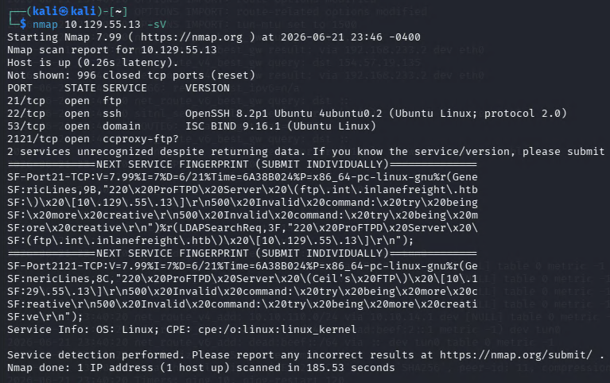
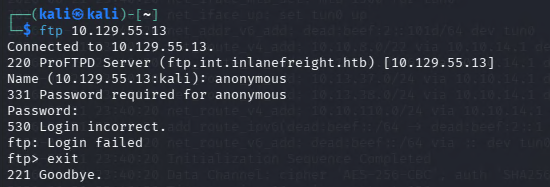
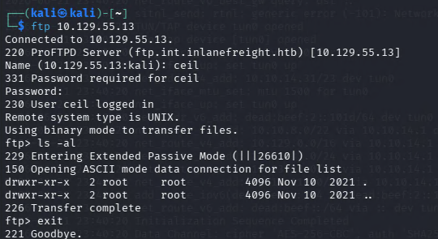
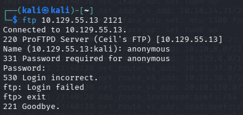
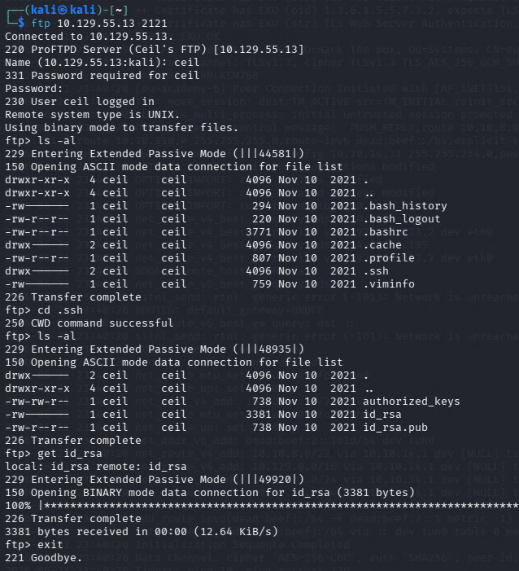
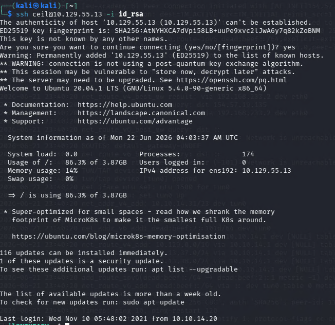
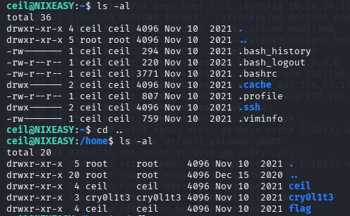
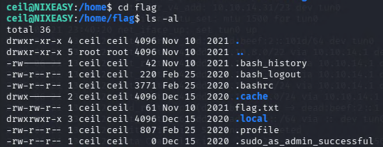
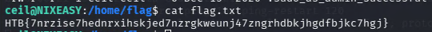

# Footprinting Lab - Easy

### Use the provided FTP credentials to enumerate the exposed FTP services and retrieve the flag.


- 這裡是題目一開始提供的資訊，重點是可用的 FTP 帳號密碼。
- 題目既然直接給 credentials，先拿這組帳密去測開著的 FTP 服務。



```bash
nmap 10.129.55.26 -sV -sC
```

- 先用 `nmap` 對目標做基礎掃描，確認目前有哪些服務對外開放。
- 掃描後確認有兩個 FTP 相關 port，不能只測預設的 `21/tcp`。



- 第一個測試的是 `21/tcp`，先用最常見的 `anonymous` 登入方式驗證是否存在匿名存取。
- 結果失敗，表示這條路行不通。



- 接著改用題目提供的帳密登入 `21/tcp`。
- 雖然可以登入，但列目錄後沒拿到東西，繼續看另一個 FTP port。



- 同樣先測試 `2121/tcp` 是否允許匿名登入。
- 這裡結果也失敗，所以還是要回到題目提供的帳密。



- 再用 `ceil / qwer1234` 登入 `2121/tcp`，這次有比較關鍵的內容。
- `ls -al` 可以看到 `.ssh` 目錄，優先檢查裡面有沒有 SSH 金鑰。
- FTP 既然能看到 `.ssh`，下一步就是把私鑰抓下來，直接改走 SSH。



```bash
chmod 600 id_rsa
ssh ceil@<TARGET_IP> -i id_rsa
```

- 將私鑰下載到本機後，先把權限調整成只有目前使用者可讀。
- 權限正確之後，就可以直接使用私鑰登入 SSH 服務，成功取得主機上的互動式 shell。



- 登入後先看家目錄和可讀路徑，找 `flag` 相關檔案。



- 進入對應的 `flag` 檔案或目錄後，直接把內容讀出來。



```bash
HTB{7nrzise7hednrxihskjed7nzrgkweunj47zngrhdbkjhgdfbjkc7hgj}
```
