# Footprinting Lab - Hard

### Enumerate the exposed services, identify valid database access, and recover the password for the user "HTB".

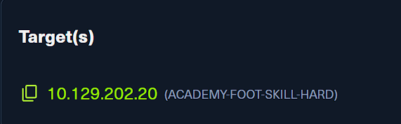

- 這一題的重點不是只盯著單一服務，而是把多個枚舉結果一路串起來，最後回到資料庫找出 `HTB` 的密碼。
- 所以一開始先把 TCP 與 UDP 服務都盤點清楚，確認有哪些入口值得深入。

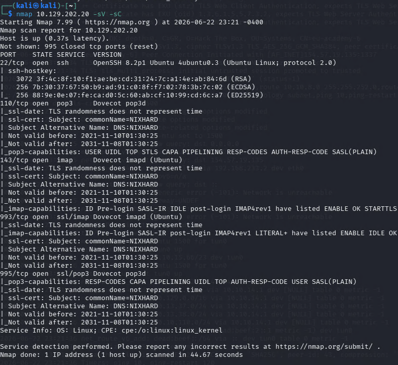

```bash
nmap 10.129.202.20 -sV -sC
```

- 先用 TCP 掃描拿到第一輪的服務版本與預設腳本資訊。

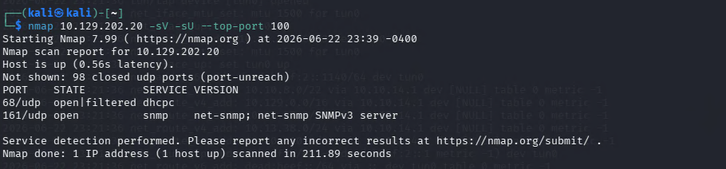

```bash
nmap 10.129.202.20 -sV -sU --top-port 100
```

- 再補上一輪 UDP 掃描，因為像 SNMP 這類服務常常只會出現在 UDP。
- 這一步很重要，因為後面的突破點正是從 SNMP 來的。

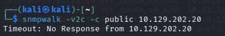

```bash
snmpwalk -v2c -c public 10.129.202.20
```

- 既然掃描有看到 SNMP，就先用最常見的 community string `public` 測試看看能不能直接讀資料。
- 這裡沒有成功，代表 SNMP 不一定是關的，更可能只是 community string 不是預設值。

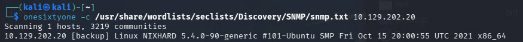

```bash
onesixtyone -c /usr/share/wordlists/seclists/Discovery/SNMP/snmp.txt 10.129.202.20
```

- 因為 `public` 失敗，所以改用 `onesixtyone` 搭配字典去找有效的 SNMP community string。
- 這裡成功找到 `backup`，表示 SNMP 其實有開，只是用了不同的設定。

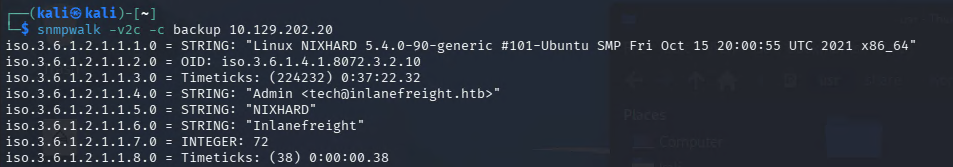

```bash
snmpwalk -v2c -c backup 10.129.202.20
```

- 換成 `backup` 之後，SNMP 的資訊就能正常讀出來。
- 這裡先拿到主機名稱 `NIXHARD`、組織 `Inlanefreight`，以及聯絡信箱 `tech@inlanefreight.htb`，確認這條路是有料的。

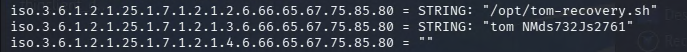

- 繼續往下看 SNMP 回傳內容，可以直接看到 `/opt/tom-recovery.sh`，以及 `tom NMds732Js2761` 這種很像帳號與密碼的字串。
- 到這一步，SNMP 已經不只是提供環境資訊，而是直接給出可拿去驗證其他服務的憑證。

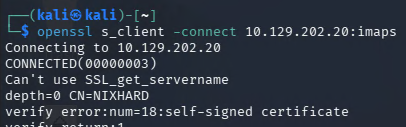

```bash
openssl s_client -connect 10.129.202.20:imaps
```

- 因為前面的掃描有看到 IMAPS，而剛剛又拿到了 `tom` 的疑似帳密，所以先確認 993/tcp 是否真的可用。
- 連線成功後，就可以進一步嘗試直接登入郵件服務。

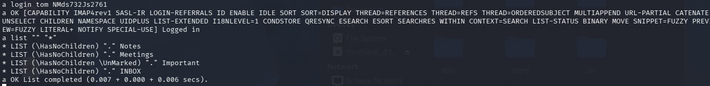

```text
a login tom NMds732Js2761
a list "" "*"
```

- 這裡用 SNMP 拿到的帳密登入 IMAP，並列出可用的 mailbox。
- 可以看到 `Notes`、`Meetings`、`Important` 與 `INBOX`，代表這組憑證確實有效。

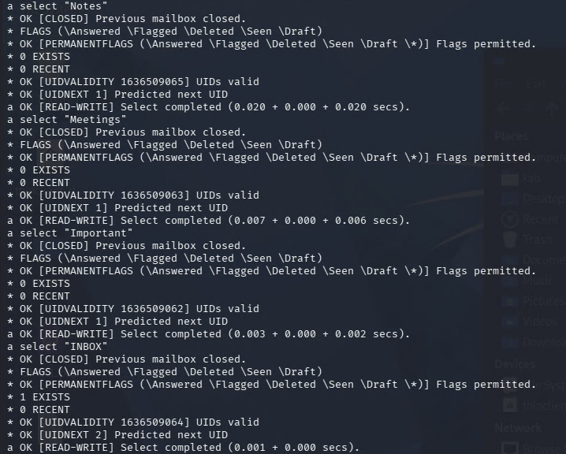

```text
a select "Notes"
a select "Meetings"
a select "Important"
a select "INBOX"
```

- 接著逐個查看哪些信箱裡真的有內容。
- 從回應可以看出前面幾個資料夾都沒有郵件，`INBOX` 則顯示有 1 封信，所以接下來直接把信件內容抓出來。

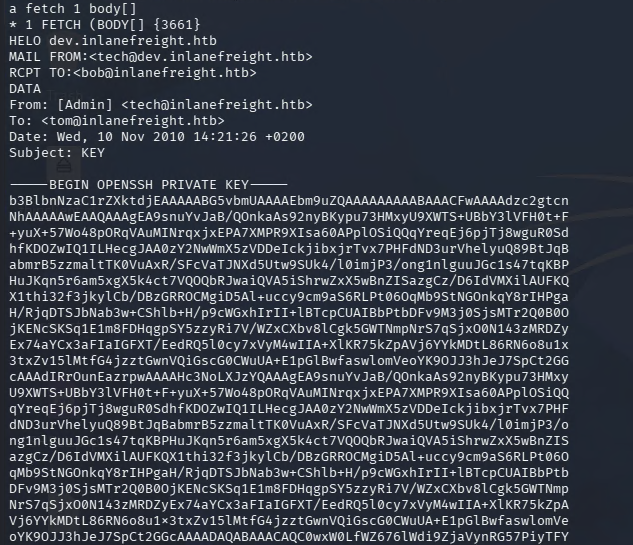

```text
a fetch 1 body[]
```

- 這封信的主旨是 `KEY`，內容直接附上一把 OpenSSH private key。
- 也就是說，前面從 SNMP 拿到的資訊，不只可以登入信箱，還能進一步換成主機的登入權限。

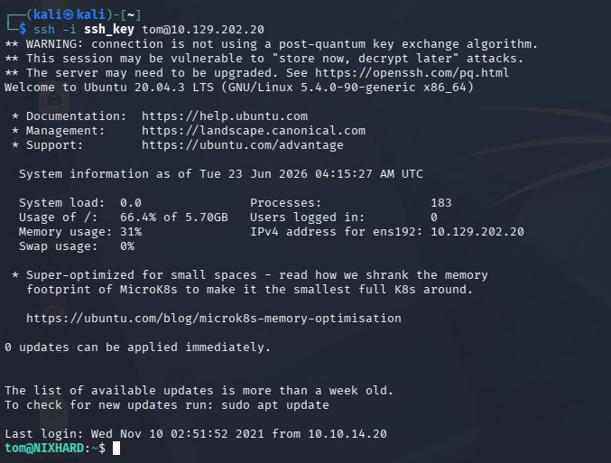

```bash
ssh -i ssh_key tom@10.129.202.20
```

- 使用信件中的私鑰登入後，成功取得 `tom` 的 shell。
- 先拿到主機內部的 shell，因為資料庫服務常常只允許本機存取，後面就能直接在主機上測試 MySQL。

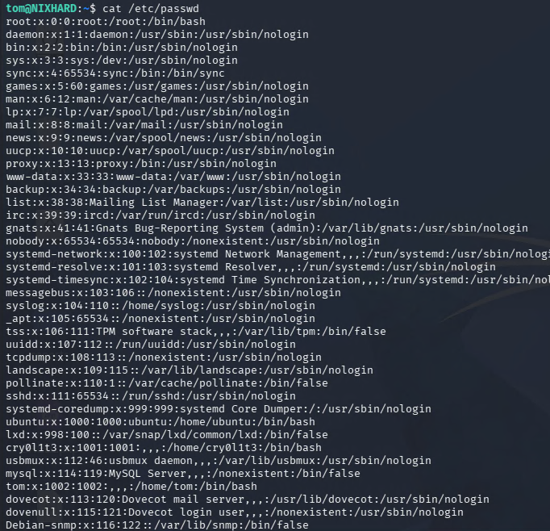

```bash
cat /etc/passwd
```

- 登入後先做基本的本機枚舉，確認主機上的使用者與服務帳號。
- 既然前面一路都圍繞在 `tom` 這個帳號，接下來就直接嘗試用同一組憑證登入本機 MySQL。

```bash
mysql -u tom -p
show databases;
use users;
show tables;
```

- 這裡可以成功以 `tom` 身分存取 MySQL，表示我們已經找到題目要求的 valid database access。

```bash
show columns from users;
```

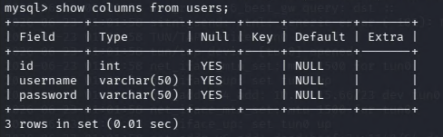

- 先確認 `users` 表的欄位，避免在欄位名稱不確定的情況下盲查。

```bash
select * from users where username like "HTB";
```

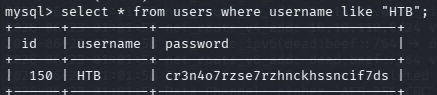

- 查詢結果中就能直接看到 `HTB` 對應的密碼。

```text
cr3n4o7rzse7rzhnckhssncif7ds
```
