# Footprinting Lab - Medium

### Enumerate the server carefully and find the username "HTB" and its password. Then, submit this user's password as the answer.

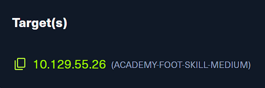

- 這題的關鍵不是單一服務，而是要把多個服務枚舉結果串起來，最後一路追到 `HTB` 使用者的密碼。
- 因此一開始要先做完整的服務盤點，確認有哪些可利用的檔案服務與遠端管理入口。

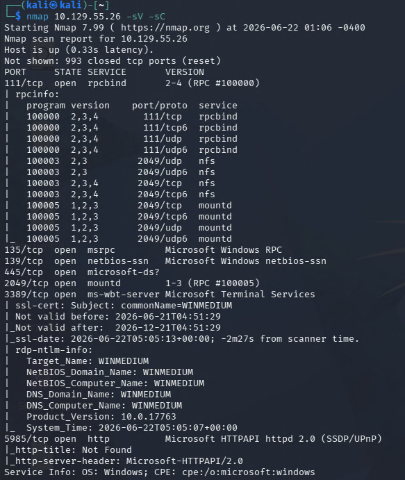

```bash
nmap 10.129.55.26 -sV -sC
```

- 掃描後看到 NFS 開著，先從共享目錄找資料。

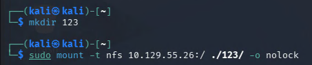

- 先在本機建立掛載用的資料夾，再把 NFS share 掛載進來。
- 掛進來後直接當成本地目錄翻內容。

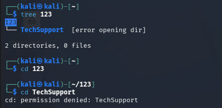

- 掛載回來後先看到 `TechSupport` 相關資料，但部分位置權限受限，還得繼續往下翻。

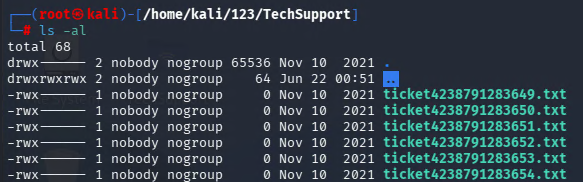
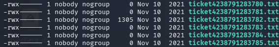

- 繼續往資料夾內部翻找時，可以發現多個 ticket 檔案。
- 其中 `ticket4238791283682.txt` 是唯一真正有內容的檔案，因此優先查看它的內容。

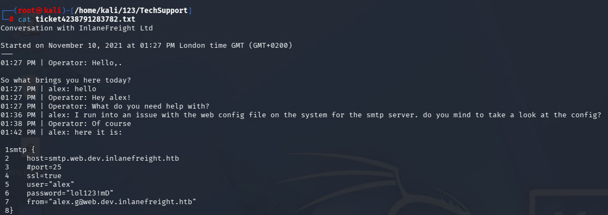

- 從該 ticket 中可以取得第一組有效帳密：

```
user: alex
password: lol123!mD
```

- 有了帳密之後，下一步就是拿去驗證其他可登入的服務，特別是 SMB 這種很常藏額外檔案的地方。

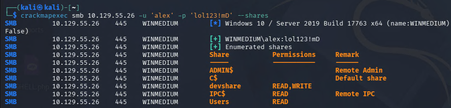

- 因為從前面的掃描結果看得出來目標不是使用較舊的 SMBv1，所以這裡不走 `enum4linux`，而改用 `crackmapexec` 來做枚舉。
- 用 `alex` 的帳密測試後，確認他對 `devshare`、`IPC$`、`Users` 等 share 有存取權限。

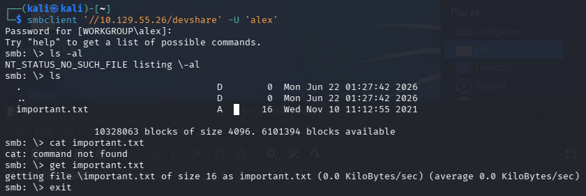

- 接著直接用 `smbclient` 連入可讀 share，並把裡面的 `important.txt` 下載回本地。

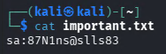

- 讀取 `important.txt` 後，又拿到一組新的帳密。
- 這裡可以整理成一條鏈：先從 NFS 拿到 `alex` 的帳密，再從 SMB 拿到下一組可繼續利用的憑證。

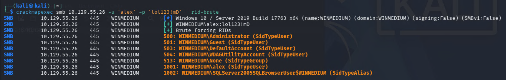

- 接下來繼續用 `crackmapexec` 枚舉可用使用者，並整理成清單。
- 後面就直接拿 `important.txt` 裡的密碼去對這些帳號逐一驗證。

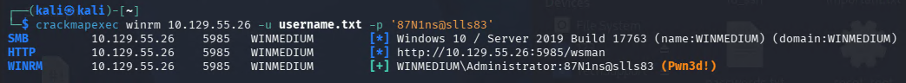

- 進一步驗證後，可以確認這組高權限帳密能夠登入遠端服務。
- 這裡是直接走圖形化遠端桌面登入：

```
xfreerdp /v:10.129.55.26 /u:Administrator /p:87N1ns@slls83 /dynamic-resolution
```

- 登入後再到系統內部找 `HTB` 使用者的密碼。

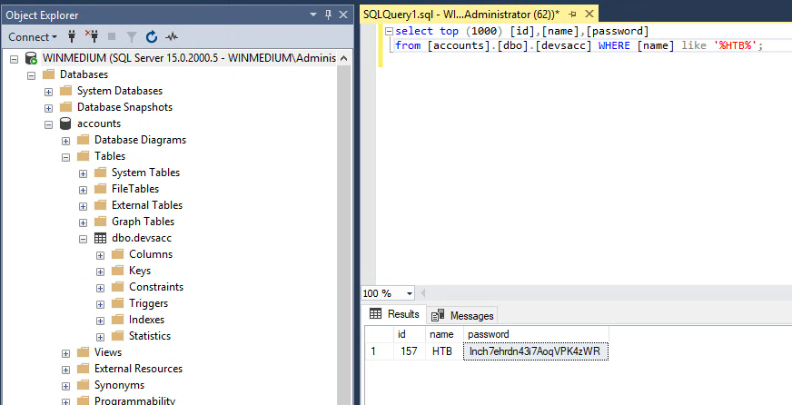

```bash
lnch7ehrdn43i7AoqVPK4zWR
```
