# Footprinting

## FTP
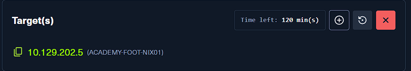

### Which version of the FTP server is running on the target system? Submit the entire banner as the answer.
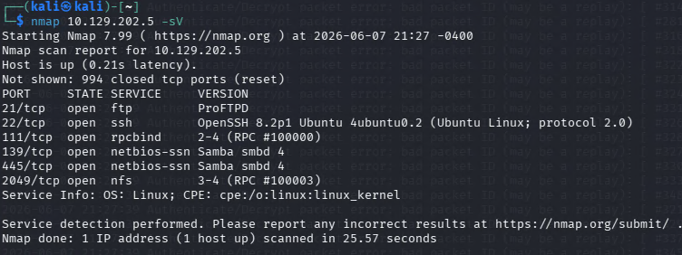

- 先對目標做基本的服務辨識，確認有哪些對外開放的服務，以及它們回傳的 banner。
- 這一題的重點是直接從 FTP 的版本資訊中讀取完整字串，而不是只看服務類型。

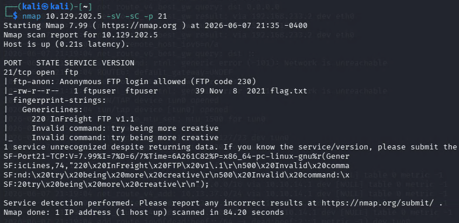

- 從結果中可以看到 FTP server 的完整 banner 為：

```bash
InFreight FTP v1.1
```

### Enumerate the FTP server and find the flag.txt file. Submit the contents of it as the answer.
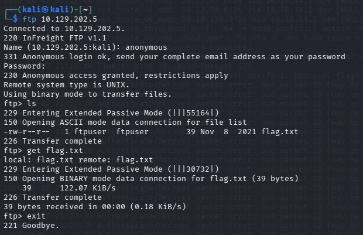

- 接著直接連入 FTP 服務，檢查可瀏覽的目錄與檔案。
- 這一步的目標不是登入後做複雜操作，而是先確認伺服器是否允許列目錄、讀檔，以及是否直接把 flag 暴露在可存取位置。

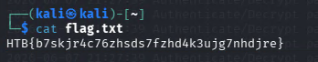

- 成功枚舉後即可找到 `flag.txt`，並直接讀取內容。

```bash
HTB{b7skjr4c76zhsds7fzhd4k3ujg7nhdjre}
```

## SMB

### What version of the SMB server is running on the target system? Submit the entire banner as the answer.


- SMB 的版本資訊同樣可以先從整體服務掃描結果裡確認。
- 這一題不需要先登入 share，只要從服務辨識的結果中擷取對應 banner 即可。

```bash
Samba smbd 4
```

### What is the name of the accessible share on the target?
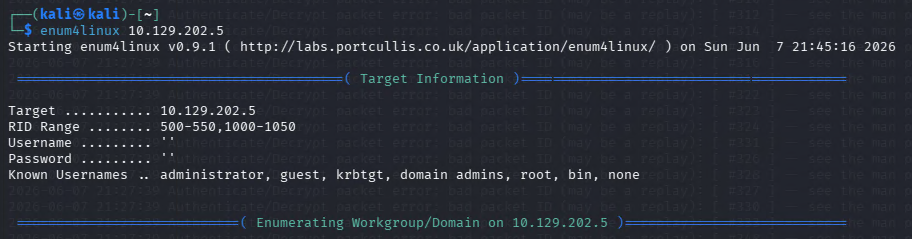

- 接著開始枚舉 SMB shares，確認有哪些 share 可以匿名或以目前權限存取。
- 這一步通常會先列出 share 名稱，再進一步查看哪些是可讀、可進入或值得深入調查的。

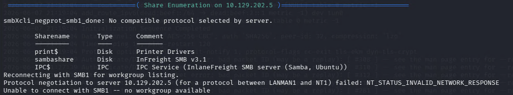

- 從枚舉結果中可以看到可存取的 share 名稱為：

```bash
sambashare
```

### Connect to the discovered share and find the flag.txt file. Submit the contents as the answer.
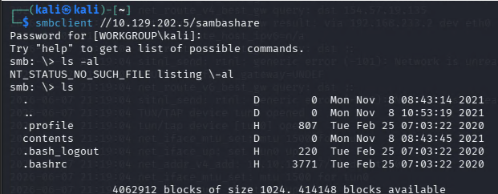

- 找到可存取的 share 後，下一步就是直接連進去，查看其中的檔案與目錄結構。

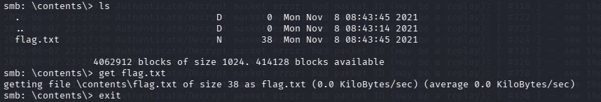

- 在列出內容之後，可以找到目標題目要的 `flag.txt`。

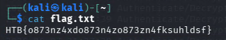

- 讀取該檔案後即可取得答案。

```bash
HTB{o873nz4xdo873n4zo873zn4fksuhldsf}
```

### Find out which domain the server belongs to.
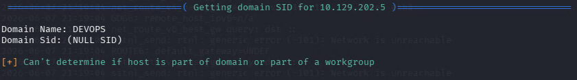

- SMB 枚舉除了 share 之外，也常常會帶出主機所屬的 workgroup 或 domain。
- 這種資訊在後續做 Windows / AD 架構盤點時很有用。

```bash
DEVOPS
```

### Find additional information about the specific share we found previously and submit the customized version of that specific share as the answer.


- 在 share 的詳細資訊裡，除了名稱與權限之外，還可能看到服務自訂的版本字串。
- 這一題要的不是 Samba 通用版本，而是這個 share 對應的 customized version。

```bash
InFreight SMB v3.1
```

### What is the full system path of that specific share? (format: "/directory/names")
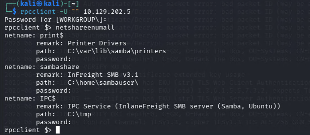

- 進一步查看 share 的詳細設定後，可以看到它在主機上的實際路徑。
- 這類資訊在後續做橫向驗證、權限交叉比對或本機提權時都很有價值。

```bash
/home/sambauser
```

## NFS

### Enumerate the NFS service and submit the contents of the flag.txt in the "nfs" share as the answer.
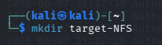

- 先枚舉 NFS exports，確認目標主機對外開放了哪些可掛載的 share。
- 和 SMB 不同，NFS 常常需要先列出 export，再手動掛載到本地目錄中查看內容。


- 找到 `nfs` share 後，先把它掛載到本地的暫存目錄。

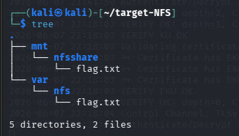

- 掛載成功後，就能像操作本地資料夾一樣列出內容並尋找 flag。

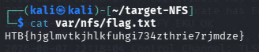

- 在 `nfs` share 中讀到的 flag 如下：

```bash
HTB{hjglmvtkjhlkfuhgi734zthrie7rjmdze}
```

### Enumerate the NFS service and submit the contents of the flag.txt in the "nfsshare" share as the answer.
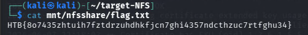

- 同樣的方式也可以套用到 `nfsshare`。
- 直接掛載該 share 並讀取其中的 `flag.txt` 即可得到答案。

```bash
HTB{8o7435zhtuih7fztdrzuhdhkfjcn7ghi4357ndcthzuc7rtfghu34}
```

## DNS

### Interact with the target DNS using its IP address and enumerate the FQDN of it for the "inlanefreight.htb" domain.
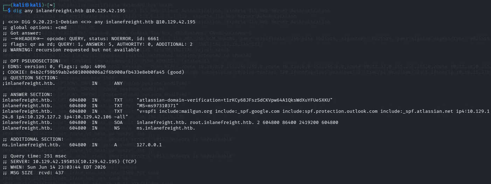

- 這一題的重點是直接對目標 DNS 伺服器發送查詢，確認它在 `inlanefreight.htb` 這個網域中的完整名稱。
- 一般會用 `dig` 或 `nslookup` 去問 NS / SOA / A records，從回應中抓出 FQDN。

```
ns.inlanefreight.htb
```

### Identify if its possible to perform a zone transfer and submit the TXT record as the answer. (Format: HTB{...})
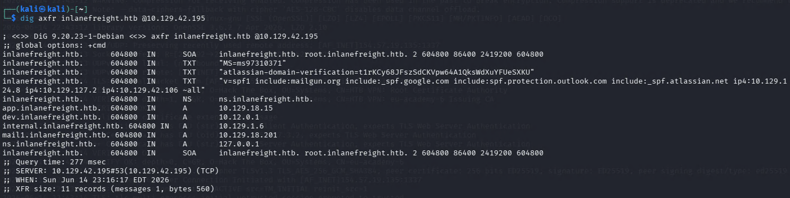

- 確認 DNS server 可互動後，下一步就是測試它是否允許 zone transfer。
- 如果設定不當，攻擊者可以一次把整個區域資料拉下來，裡面往往包含大量主機名稱、IP 對應，甚至題目直接藏的 TXT record。

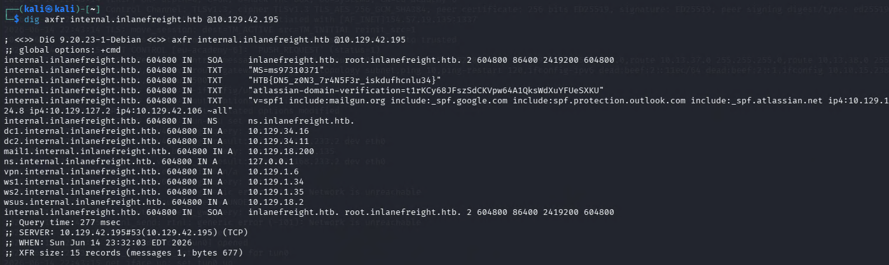

- 這裡成功做出 zone transfer，並從結果中找到題目要求的 TXT record。

```
HTB{DN5_z0N3_7r4N5F3r_iskdufhcnlu34}
```

### What is the IPv4 address of the hostname DC1?


- 這題直接從前一步 zone transfer 的結果中找 `DC1` 對應的 A record 即可。

```
10.129.34.16
```

### What is the FQDN of the host where the last octet ends with "x.x.x.203"?
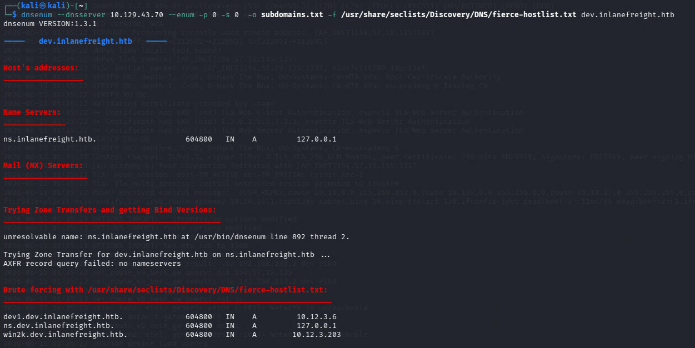

- 這裡同樣是回到 DNS 枚舉結果中比對 IP 與主機名稱。
- 找到最後一個 octet 為 `203` 的主機後，就能取得對應的 FQDN。

```
win2k.dev.inlanefreight.htb
```

## SMTP

### Enumerate the SMTP service and submit the banner, including its version as the answer.
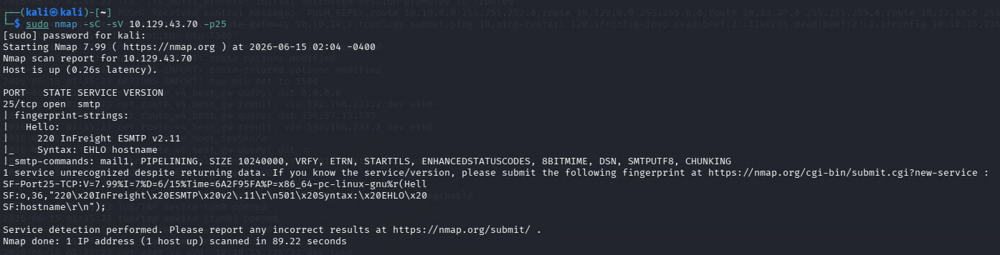

- SMTP 的第一步通常是直接與服務建立連線，查看它在初始歡迎訊息中回傳的 banner。
- 這類資訊常常會直接帶出產品名稱與自訂版本字串。

```
InFreight ESMTP v2.11
```

### Enumerate the SMTP service even further and find the username that exists on the system. Submit it as the answer.
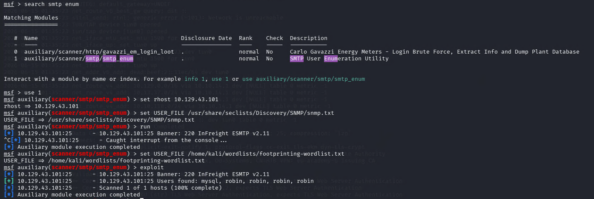

- 接著可以透過 SMTP 的使用者驗證或列舉方式，測試系統上哪些帳號存在。
- 這一步的目的是為後續密碼測試、郵件服務登入或社交工程蒐集有效帳號名稱。

```
robin
```

## IMAP / POP3

### Figure out the exact organization name from the IMAP/POP3 service and submit it as the answer.


- IMAP / POP3 在 banner 或憑證資訊中，常常會洩露組織名稱、主機名稱與其他資產辨識資訊。
- 這題要的就是從這些服務資訊中確認 exact organization name。

```
InlaneFreight Ltd
```

### What is the FQDN that the IMAP and POP3 servers are assigned to?
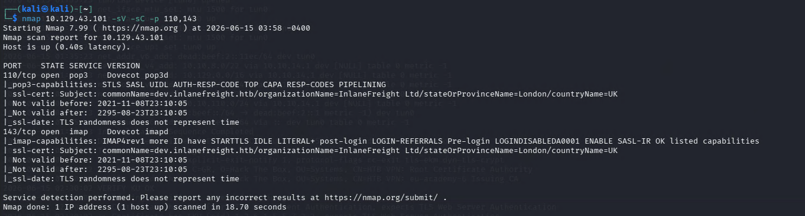

- 同樣從服務回應或憑證欄位中，可以判斷 IMAP / POP3 共同使用的主機名稱。

```
dev.inlanefreight.htb
```

### Enumerate the IMAP service and submit the flag as the answer. (Format: HTB{...})

- 這裡先用 `openssl s_client` 和 IMAPS 建立 TLS 連線，方便手動查看服務回應內容。

```
openssl s_client -connect 10.129.43.101:imaps
```

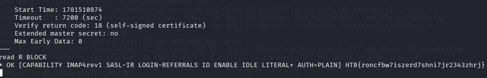

- 成功連線並枚舉後，就能直接從回應內容中取得 flag。

```
HTB{roncfbw7iszerd7shni7jr2343zhrj}
```

### What is the customized version of the POP3 server?

- 這一題改成與 POP3S 建立連線，觀察它的 banner 資訊。

```
openssl s_client -connect 10.129.43.101:pop3s
```

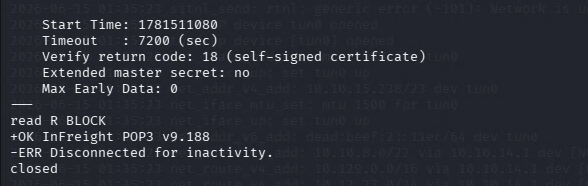

- 從回應中可以看到自訂的 POP3 版本字串。

```
InFreight POP3 v9.188
```

### What is the admin email address?

- 接著再次連上 IMAPS，這次的重點不是只看 banner，而是登入後枚舉 mailbox 或郵件內容。

```
openssl s_client -connect 10.129.43.101:imaps
```

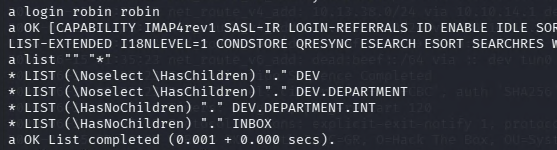
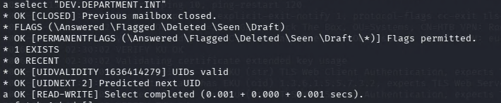


- 從登入後的資訊中可以整理出管理者使用的 email address。

```
devadmin@inlanefreight.htb
```

### Try to access the emails on the IMAP server and submit the flag as the answer. (Format: HTB{...})
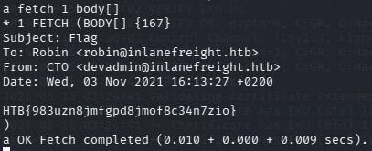

- 取得帳號相關資訊後，繼續讀取郵件內容，就能從其中找到題目要求的 flag。

```
HTB{983uzn8jmfgpd8jmof8c34n7zio}
```

## SNMP

### Enumerate the SNMP service and obtain the email address of the admin. Submit it as the answer.

- 這裡使用 `snmpwalk` 對目標主機做 SNMP 枚舉。
- 如果 community string 設定過於寬鬆，例如使用預設的 `public`，就很可能直接拿到大量系統資訊。

```
snmpwalk -v2c -c public 10.129.14.128
```

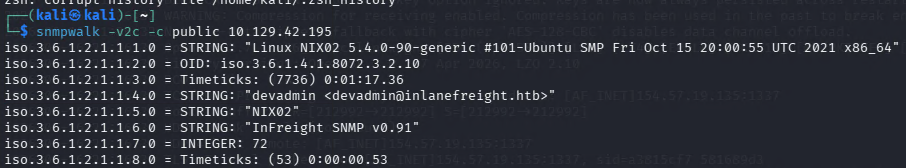

- 從 SNMP 回應中可以直接看到管理者的 email address。

```
devadmin@inlanefreight.htb
```

### What is the customized version of the SNMP server?


- 同一份 SNMP 枚舉結果裡也可以讀到自訂版本資訊，因此這題不需要重新跑不同的工具。

```
InFreight SNMP v0.91
```

### Enumerate the custom script that is running on the system and submit its output as the answer.
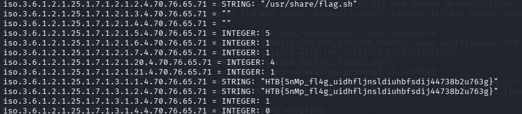

- 除了系統基本資訊外，SNMP 也常會暴露 extend / custom script 的輸出。
- 這題就是從那個自訂腳本的回傳結果中取得 flag。

```
HTB{5nMp_fl4g_uidhfljnsldiuhbfsdij44738b2u763g}
```

## MySQL

### Enumerate the MySQL server and determine the version in use. (Format: MySQL X.X.XX)
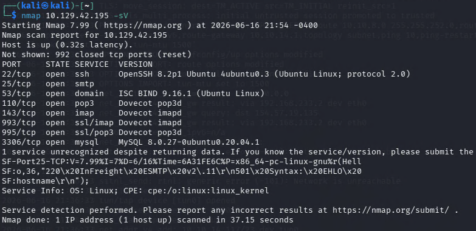

- MySQL 的版本資訊可以直接從服務枚舉或登入前的 banner 中取得。
- 這題只需要辨識版本號，不需要先進入資料庫做查詢。

```
MySQL 8.0.27
```

### During our penetration test, we found weak credentials "robin:robin". We should try these against the MySQL server. What is the email address of the customer "Otto Lang"?
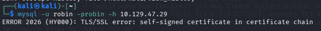

- 題目已經提供弱密碼 `robin:robin`，因此下一步就是直接拿這組帳密嘗試登入 MySQL。
- 登入成功後，先列出有哪些 databases，再切進與客戶資料相關的資料庫查看表格。

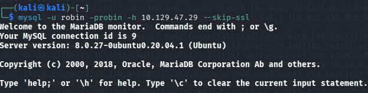

- 這裡依序查看資料庫、資料表，最後用查詢語句直接找出 `Otto Lang` 的 email。

```
show databases;
use customers;
show tables;
SELECT email FROM myTable WHERE name LIKE '%Otto Lang%';
```

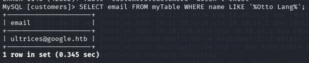

- 查詢結果如下：

```
ultrices@google.htb
```

## MSSQL

### Enumerate the target using the concepts taught in this section. List the hostname of MSSQL server.
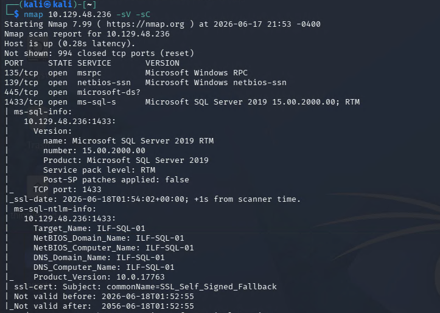

- 對 MSSQL 服務做基礎枚舉後，可以直接讀出主機名稱。
- 這類資訊常見於服務回應、實例資訊或登入後的系統查詢結果。

```
ILF-SQL-01
```

### Connect to the MSSQL instance running on the target using the account (backdoor:Password1), then list the non-default database present on the server.
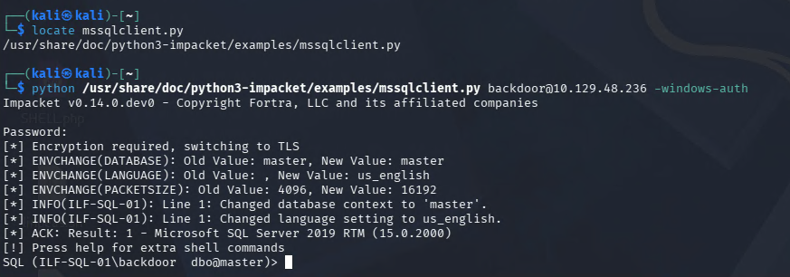

- 題目已經提供 `backdoor:Password1`，因此可以直接登入 MSSQL 實例。
- 登入後，先查詢 `sys.databases`，從清單中辨識哪個是非預設資料庫。

```
select name from sys.databases
```

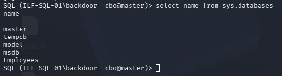

- 從結果中可以看到非預設資料庫為：

```
Employees
```

## Oracle TNS

### Enumerate the target Oracle database and submit the password hash of the user DBSNMP as the answer.
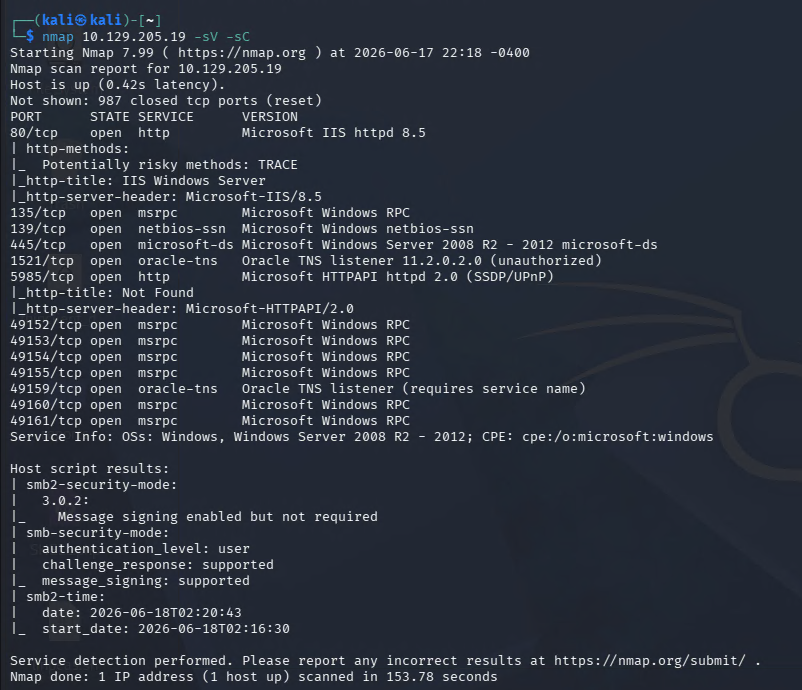

- 先透過 `nmap` 確認目標確實有對外提供 Oracle 相關服務，並查看 listener 與版本線索。

```
nmap 10.129.205.19 -sV -sC
```

- 接著使用 `odat` 進一步枚舉 Oracle TNS。
- 這裡選擇 `odat` 是因為它是 Oracle 滲透測試中很常用的工具，適合用來做 SID 枚舉、弱密碼測試與資料庫互動驗證。

```
sudo odat sidguesser -s 10.129.205.19
sudo odat passwordguesser -s 10.129.205.19 -d XE
```

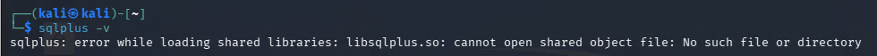

- 後續如果要用 `sqlplus` 直接連線，本機環境必須先具備對應的 Oracle client library。
- 因此先找出 `libsqlplus.so` 的位置，並把 `ORACLE_HOME`、`LD_LIBRARY_PATH` 和 `PATH` 設定好。

```
find / -name "libsqlplus.so" 2>/dev/null
export ORACLE_HOME=/usr/lib/oracle/19.6/client64/lib/
export LD_LIBRARY_PATH="$ORACLE_HOME"
export PATH="$ORACLE_HOME:$PATH"
sqlplus -v
```

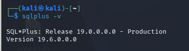
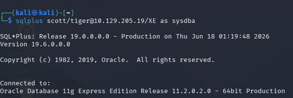

- 成功連入資料庫後，直接從 `sys.user$` 查詢使用者與密碼雜湊。

```
select name, password from sys.user$;
```

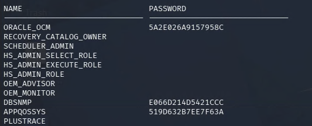

- `DBSNMP` 對應的 password hash 為：

```
E066D214D5421CCC
```

## IPMI

### What username is configured for accessing the host via IPMI?
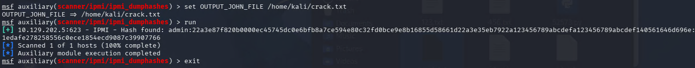


- 這裡先對 IPMI 服務做枚舉，查看是否能直接讀出設定中的管理帳號資訊。
- 許多 IPMI 設備如果配置不當，會直接暴露有效帳號名稱。

```
admin
```

### What is the account's cleartext password?
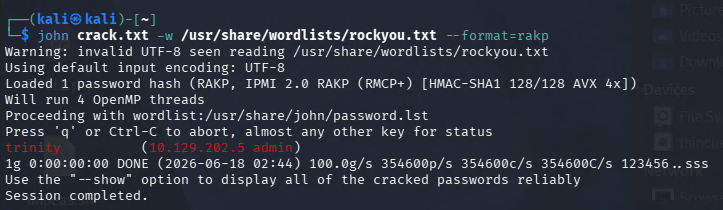

- 進一步枚舉後，可以直接取得這組帳號對應的明文密碼。

```
trinity
```
