# Information Gathering - Skills Assessment

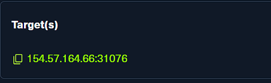

- 先從 Academy 給的 target `154.57.164.66:31076` 開始做基本探測。

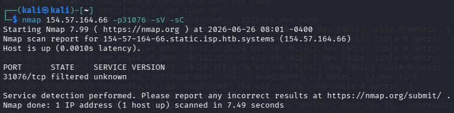

- 先跑 `nmap -sV -sC` 看看這個 target 對外開了什麼。
- 這裡沒有拿到太多服務細節，只知道 `31076/tcp` 對外開著。

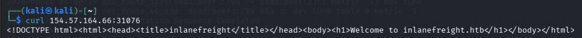

- 直接 `curl` 回去有拿到 HTML 回應，先可以判斷這是一個 HTTP 網頁服務。
- 頁面內容裡又提到 `inlanefreight.htb`，所以後面就不是只盯著 IP 看，而是要把重心放到 domain / vhost / crawl 這幾條線上。

### What is the IANA ID of the registrar of the inlanefreight.com domain?

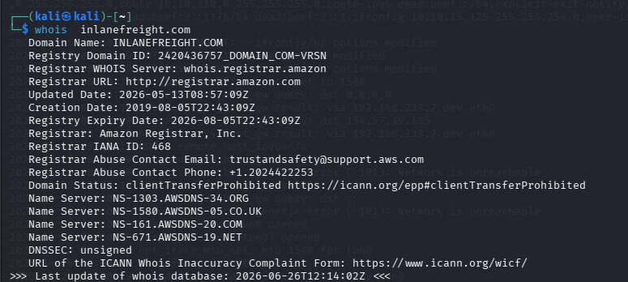

- 這題直接做 `whois inlanefreight.com` 即可。
- 在 WHOIS 結果裡找 `Registrar IANA ID` 欄位，畫面中顯示的是 `468`。

```text
468
```

### What http server software is powering the inlanefreight.htb site on the target system? Respond with the name of the software, not the version, e.g., Apache.

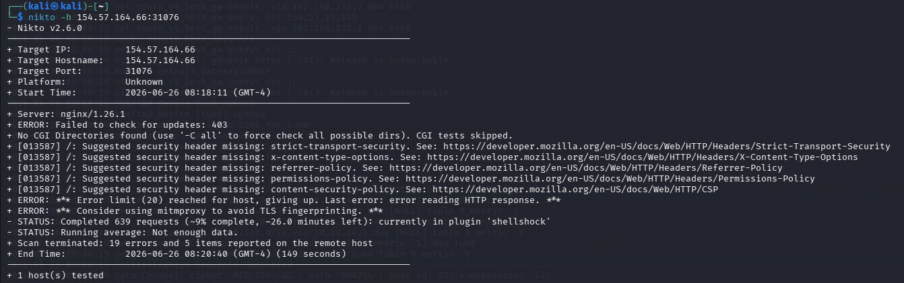

- 既然 `curl` 已經確認目標是 HTTP 服務，就再用 `nikto` 去看回應標頭與伺服器資訊。
- `nikto -h 154.57.164.66:31076` 的結果裡有 `Server: nginx/1.26.1`。
- 題目只要軟體名稱，不要版本，所以答案只填 `nginx`。

```text
nginx
```

### What is the API key in the hidden admin directory that you have discovered on the target system?

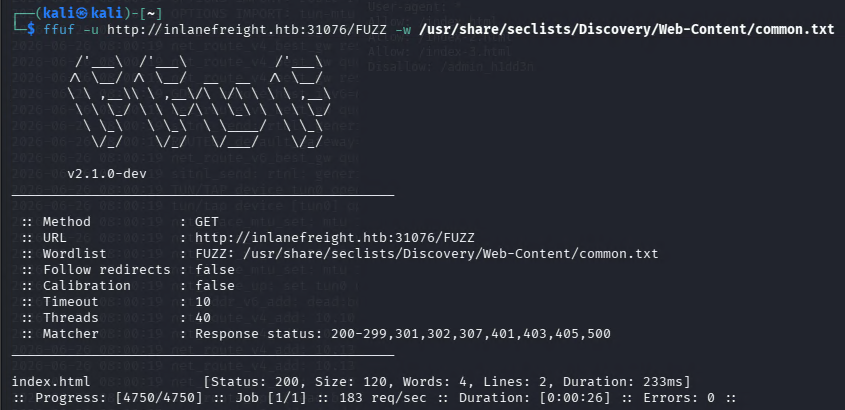

- 先用 `gobuster vhost` 對 `http://inlanefreight.htb:31076` 做 vhost 枚舉。
- 這一步的目的不是先找檔案，而是先找出有哪些有效的虛擬主機名稱。

```text
gobuster vhost -u http://inlanefreight.htb:31076 -w </path/to/wordlists> --append-domain -t 30
```

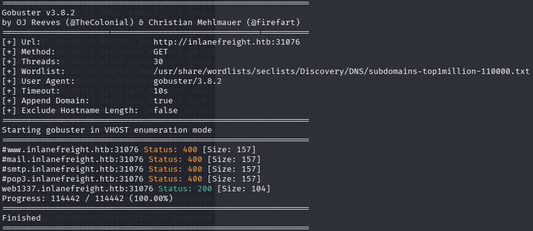

- 枚舉結果裡可以看到 `web1337.inlanefreight.htb:31076` 回傳 `200`，表示這個 vhost 是有效的。

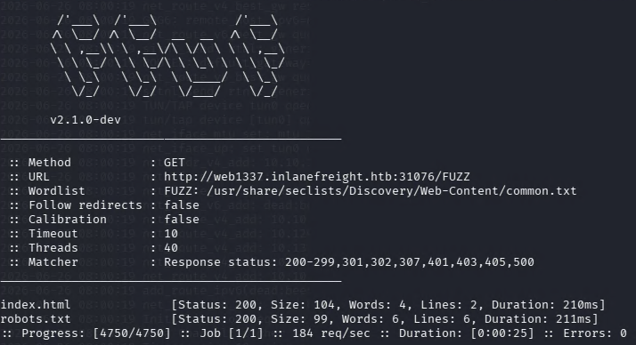

- 接著改對 `web1337.inlanefreight.htb:31076` 做內容枚舉，可以找到 `robots.txt`。

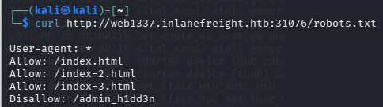

- 查看 `robots.txt` 後會看到 `Disallow: /admin_h1dd3n`，這就是題目說的 hidden admin directory。

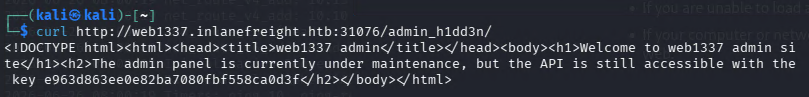

- 直接請求 `/admin_h1dd3n/`，頁面內容會把 API key 顯示出來。

```text
e963d863ee0e82ba7080fbf558ca0d3f
```

### After crawling the inlanefreight.htb domain on the target system, what is the email address you have found? Respond with the full email, e.g., mail@inlanefreight.htb.

```text
python3 ReconSpider.py http://inlanefreight.com:31076
cat results.json
```

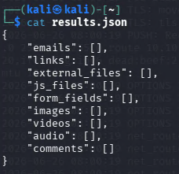

- 先對根站做 `ReconSpider`，但 `results.json` 裡 `emails` 是空的，所以答案不在這一層。

```text
python3 ReconSpider.py http://web1337.inlanefreight.com:31076
cat results.json
```

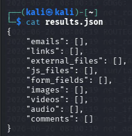

- 對 `web1337` 再做一次 crawl 之後，`results.json` 裡一樣沒有直接拿到 email。

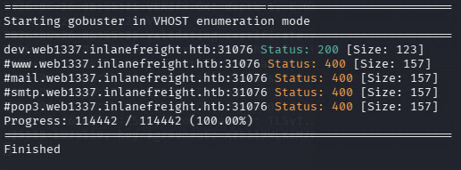

- 但從這張 vhost 枚舉結果可以看到又找到一個新的 vhost：`dev.web1337.inlanefreight.htb:31076`。
- 所以這題要再往 `dev` 那層繼續爬。

```text
python3 ReconSpider.py http://dev.web1337.inlanefreight.htb:31076
cat results.json
```

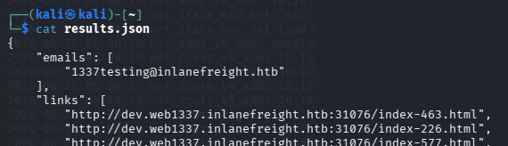

- 這次在 `results.json` 的 `emails` 陣列裡就能看到目標信箱。

```text
1337testing@inlanefreight.htb
```

### What is the API key the inlanefreight.htb developers will be changing too?

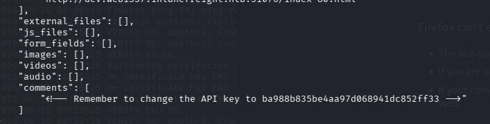

- 同一份 `dev.web1337` 的 crawl 結果裡，不只找到 email，還在 `comments` 陣列中看到開發者留下的註解。
- 註解內容明確寫著要把 API key 改成新的值，所以直接取出那串 key 即可。

```text
ba988b835be4aa97d068941dc852ff33
```


