# Network Enumeration with Nmap

## Host Discovery

### Based on the last result, find out which operating system it belongs to. Submit the name of the operating system as result.
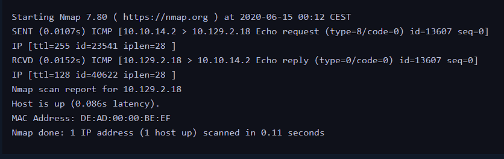

- 這一題是根據前一步的封包回應結果來判斷作業系統。
- 一般來說，`TTL 64` 常見於 Linux / Unix 類系統，`TTL 128` 則常見於 Windows。
- 從圖中的結果可以看到回應封包的 TTL 接近 `128`，因此可以推測目標主機屬於 Windows 系統。

```bash
WINDOWS
```

## Host and Port Scanning
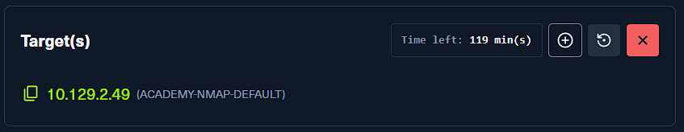

### Find all TCP ports on your target. Submit the total number of found TCP ports as the answer.
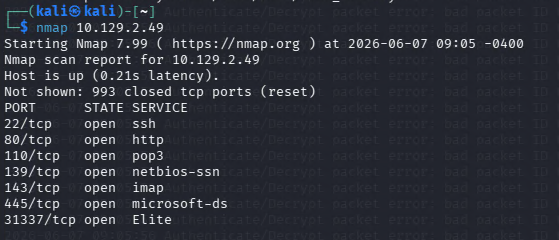

- 先對目標做基本的 TCP 掃描，確認目前有哪些服務對外開放。
- 這一步的重點不是立刻分析每個服務，而是先把開放的 attack surface 列出來。

```bash
nmap 10.129.2.49
```

- 從掃描結果可以數出目前共有 `7` 個開放的 TCP ports。

```bash
7
```

### Enumerate the hostname of your target and submit it as the answer. (case-sensitive)
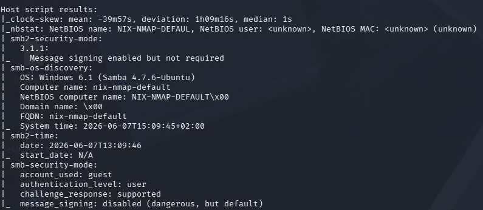

- 接著使用 `-sC` 執行 Nmap 的預設 NSE scripts，讓它自動跑一些常見的服務枚舉。
- 在這裡的重點是查看 `smb-os-discovery` 相關輸出，因為這類資訊很常直接包含主機名稱。

```bash
nmap 10.129.2.49 -sC
```

- 從結果中可以看到 target 的 computer name 是：

```bash
nix-nmap-default
```

### Perform a full TCP port scan on your target and create an HTML report. Submit the number of the highest port as the answer.

- 這一題的重點是做完整的 TCP 掃描，而不是只掃 Nmap 預設的常見 ports。
- 從完整掃描結果可以看到最高的開放 port 是 `31337`。
- 如果要另外保留報告，也可以在掃描時同時把結果輸出成檔案，再轉成 HTML 供後續查看。

```bash
31337
```

### Enumerate all ports and their services. One of the services contains the flag you have to submit as the answer.
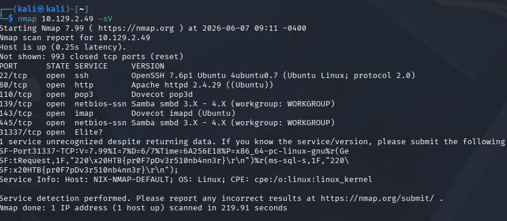

- 這一步改用 `-sV` 去辨識各個開放 ports 上實際運行的服務與版本資訊。
- 某些靶機會故意把 flag 藏在 banner 或 version string 裡，這一題就是這種類型。

```bash
nmap 10.129.2.49 -sV
```

- 從服務版本資訊中可以直接找到 flag：

```bash
HTB{pr0F7pDv3r510nb4nn3r}
```

### Use NSE and its scripts to find the flag that one of the services contain and submit it as the answer.
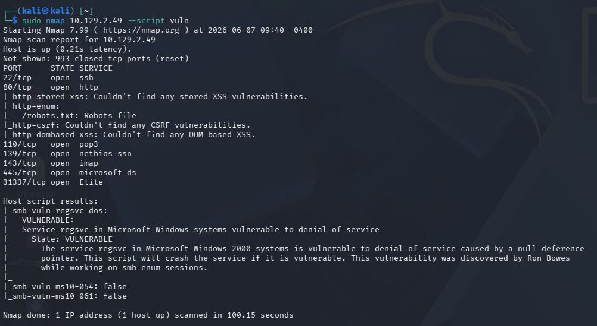

- 這裡使用 Nmap 內建的 NSE 腳本進一步做服務層面的檢查。
- `--script vuln` 會跑一批常見的漏洞與弱點相關腳本，適合快速看看某些服務是否暴露了額外資訊。

```bash
nmap 10.129.2.49 --script vuln
```

- 從結果中可以注意到 Web 服務提到了 `robots.txt`，表示可能還有額外內容值得查看。

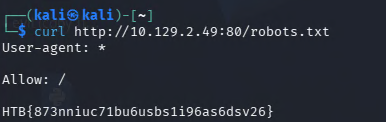

- 接著直接用 `curl` 讀取目標站台的 `robots.txt`，確認裡面是否藏有題目需要的內容。
- 這一步的核心概念和前面做 Web 枚舉時很像：`robots.txt` 雖然不是權限控管，但常常會洩露有用的路徑或資訊。

```bash
curl http://<TARGET_IP>/robots.txt
```

- 成功讀取後即可取得 flag：

```bash
HTB{873nniuc71bu6usbs1i96as6dsv26}
```

## Firewall and IDS/IPS Evasion - Easy Lab
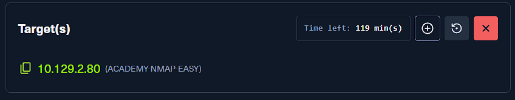

### Our client wants to know if we can identify which operating system their provided machine is running on. Submit the OS name as the answer.
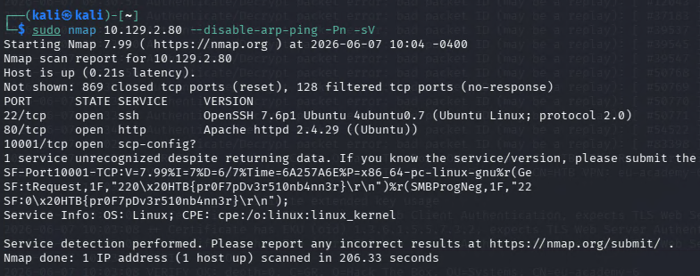

- 這一題的目標不是單純掃描，而是測試在較受限制的環境下，是否還能從服務資訊判斷系統類型。
- 這裡使用 `--disable-arp-ping` 與 `-Pn`，代表略過一般的 host discovery，直接把目標當成 online 主機處理。
- 再搭配 `-sV` 去抓服務版本，從回應的 banner 中就能辨識出作業系統線索。

```bash
nmap 10.129.2.80 --disable-arp-ping -Pn -sV
```

- 從服務版本資訊可以判斷目標系統為：

```bash
Ubuntu
```

## Firewall and IDS/IPS Evasion - Medium Lab
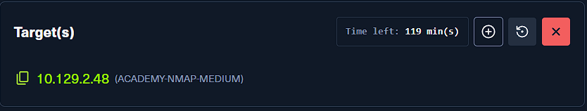

### After the configurations are transferred to the system, our client wants to know if it is possible to find out our target's DNS server version. Submit the DNS server version of the target as the answer.
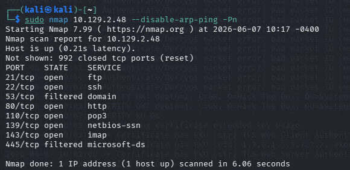

- 先對這台主機做基本掃描，確認它是否有開放 DNS 相關服務。
- 從初步結果可以看出 `53/tcp` 的資訊並不明顯，表示直接用一般 TCP 掃描可能無法拿到想要的答案。

```bash
nmap 10.129.2.48 --disable-arp-ping -Pn
```

- 既然目標是 DNS 服務，下一步就應該改從 `UDP 53` 下手，並進一步要求版本辨識。

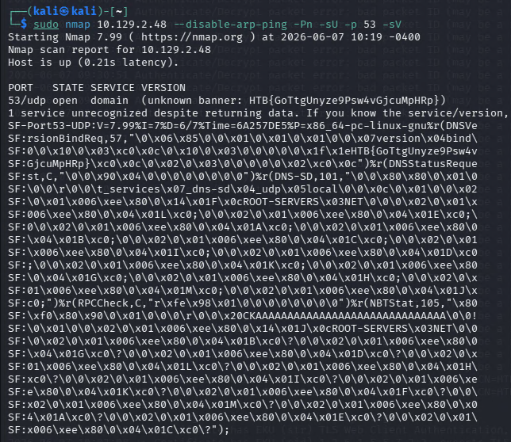

- 這裡使用 `-sU` 掃 UDP、`-p 53` 指定 DNS port，再搭配 `-sV` 取得服務版本。

```bash
nmap 10.129.2.48 --disable-arp-ping -Pn -sU -p 53 -sV
```

- 成功取得 DNS server version 後，題目要求提交的 flag 如下：

```bash
HTB{GoTtgUnyze9Psw4vGjcuMpHRp}
```

## Firewall and IDS/IPS Evasion - Hard Lab
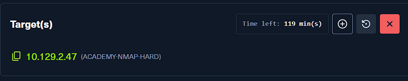

### Now our client wants to know if it is possible to find out the version of the running services. Identify the version of service our client was talking about and submit the flag as the answer.
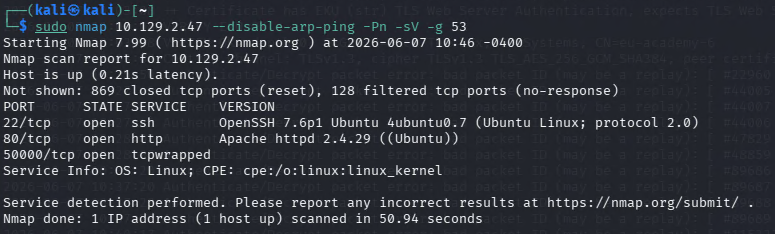

- 這一題的關鍵在於一般掃描方式會被過濾，因此要改用來源 port 偽裝的方式測試。
- 這裡利用 `-g 53` 指定 source port，模擬看起來像是 DNS 流量的連線，再重新掃描目標。
- 透過這種方式可以發現原本不明顯的 `50000/tcp` 是開放的。

```bash
nmap 10.129.2.47 -Pn -p- -g 53
```

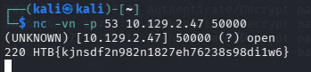

- 找到可疑的高 port 之後，接著直接用 `netcat` 連上去查看回應內容。
- 這裡同樣指定來源 port 為 `53`，讓連線更符合前一步繞過限制的方式。

```bash
nc -vn -p 53 10.129.2.47 50000
```

- 連上後即可直接取得題目要求的 flag：

```bash
HTB{kjnsdf2n982n1827eh76238s98di1w6}
```
