# Vulnerability Assessment

- 這份比較偏向掃描結果判讀，重點不是 exploitation，而是知道該去 Nessus / OpenVAS 的哪個頁面找答案。
- 另外要先分清楚 Academy 顯示的 target IP，和掃描工具裡實際列出的內網主機 IP 不一定相同。

## Nessus Skills Assessment

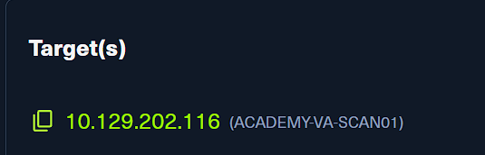

- 先進入 Nessus 的掃描清單，這一段題目都從 `Windows_basic_authed` 這份 authenticated scan 取答案。
- Academy 頁面顯示的是練習環境 target，但實際在 Nessus 報表中要看的 Windows 主機是後面出現的 `172.16.16.100`。

### What is the name of one of the accessible SMB shares from the authenticated Windows scan? (One word)

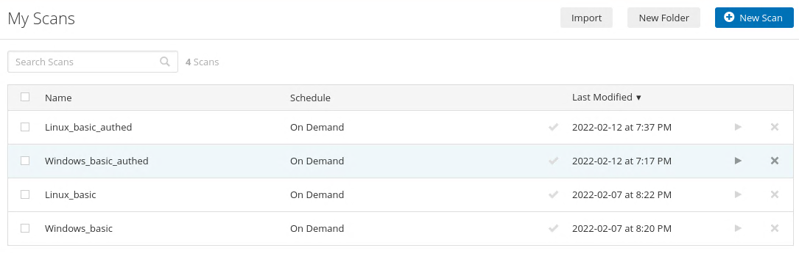
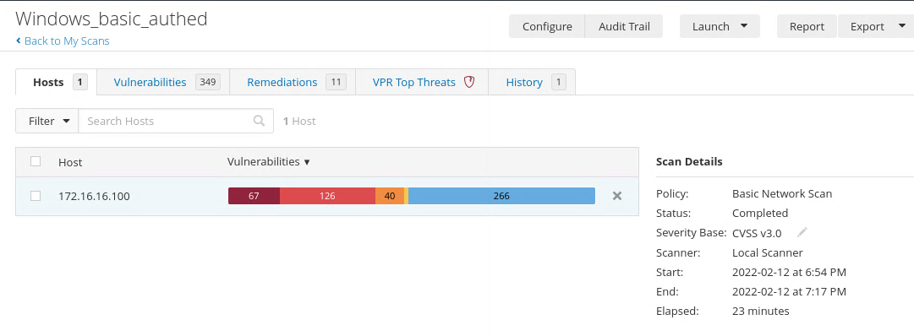

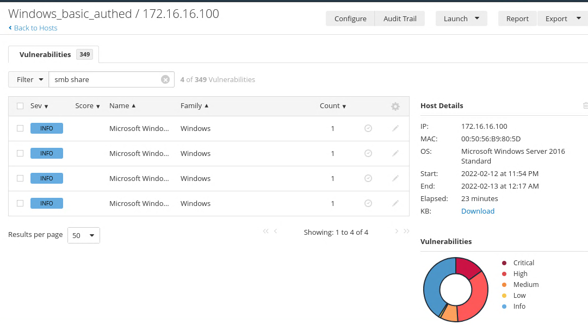
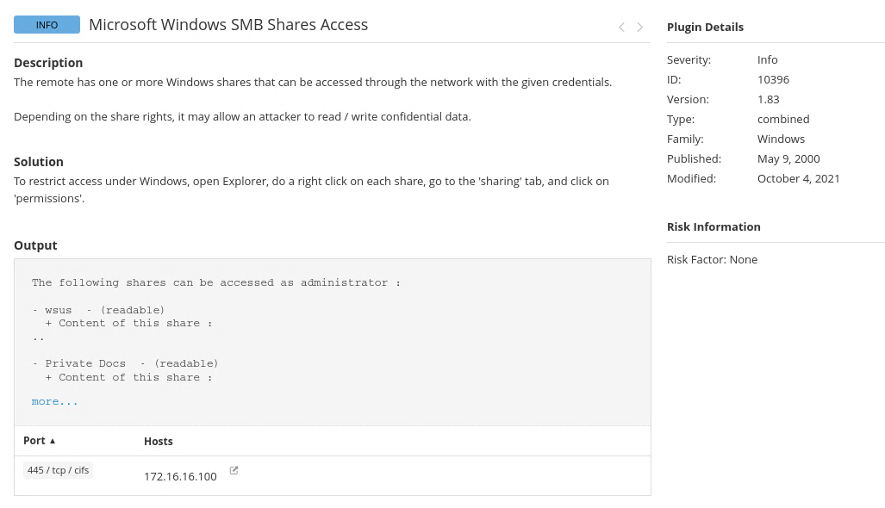

- 先打開 `Windows_basic_authed`，進到 `Hosts` 後選唯一那台主機 `172.16.16.100`。
- 接著在 Vulnerabilities 頁面用 `smb share` 當關鍵字過濾，先把結果縮到 SMB share 相關項目。
- 點進 `Microsoft Windows SMB Shares Access` 後，看 `Output` 區塊，這裡會直接列出用目前憑證可存取的 share。
- 畫面中可以看到 `wsus` 與 `Private Docs` 都是 readable，所以題目要填其中一個即可。

```text
wsus
```

### What was the target for the authenticated scan?

- 同樣在 `Windows_basic_authed` 這份掃描中，看 `Hosts` 分頁或右側 `Host Details` 都能確認這台 Windows 主機的 IP。
- 這題問的是 authenticated Windows scan 的 target，不是 Academy 顯示的外層 target IP。

```text
172.16.16.100
```

### What is the plugin ID of the highest criticality vulnerability for the Windows authenticated scan?

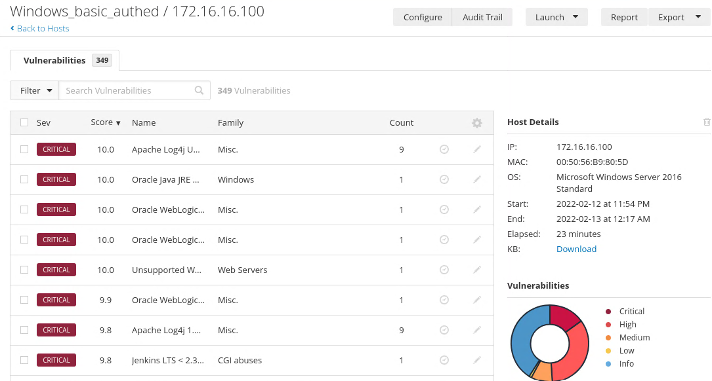
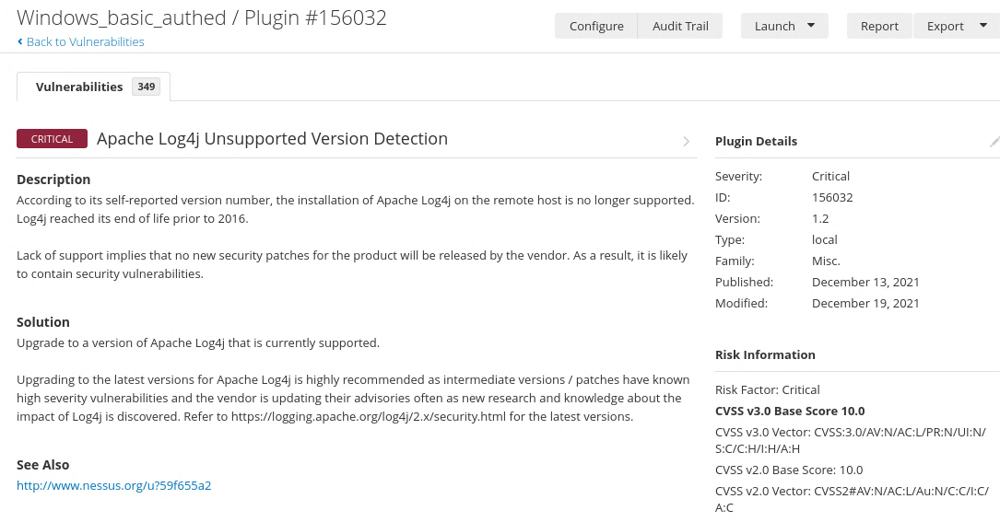

- 回到 `172.16.16.100` 的 Vulnerabilities 清單，可以看到多個 Critical 項目，先從列表最上方的高嚴重度項目點進去看詳細資訊。
- Nessus 的詳細頁右側會有 `Plugin Details`，其中 `ID` 欄位就是題目要的 plugin ID。
- 這裡點進去的是 `Apache Log4j Unsupported Version Detection`，對應的 ID 是 `156032`。

```text
156032
```

### What is the name of the vulnerability with plugin ID 26925 from the Windows authenticated scan? (Case sensitive)

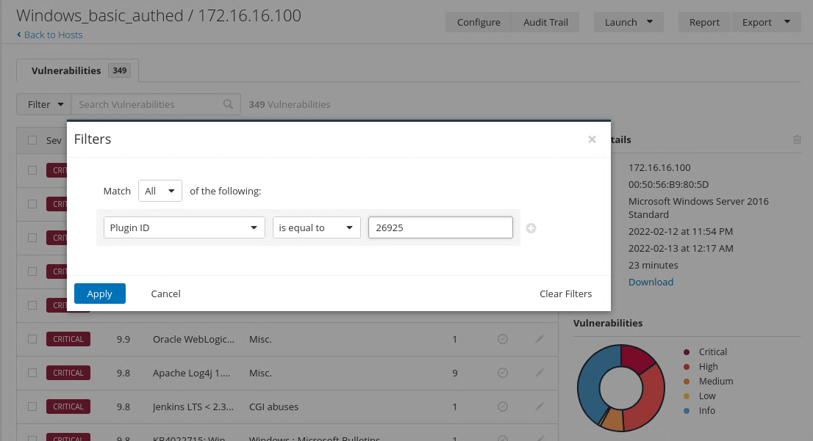
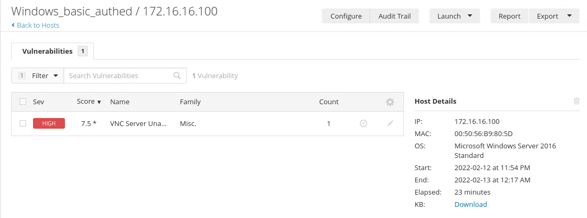
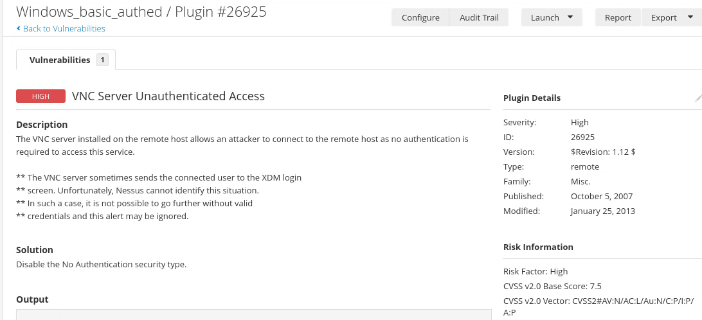

- 這題最直接的做法就是用 Nessus 的篩選器，不用手動翻完整個清單。
- 把條件設成 `Plugin ID is equal to 26925` 後，結果會只剩下一筆。
- 過濾後顯示的名稱就是答案：`VNC Server Unauthenticated Access`。

```text
VNC Server Unauthenticated Access
```

### What port is the VNC server running on in the authenticated Windows scan?

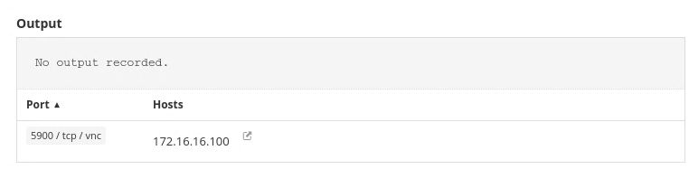

- 延續上一題同一筆 VNC finding，往下看 `Port` 區塊即可。
- 這裡明確標出服務在 `5900/tcp`。

```text
5900
```

## OpenVAS Skills Assessment

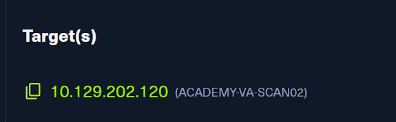

- OpenVAS 這一段的邏輯和 Nessus 類似，差別只是介面換成 Greenbone Security Assistant。
- 題目要看的主要是 Linux 主機的掃描結果，後面在報表裡對應的是 `172.16.16.160`。

### What type of operating system is the Linux host running? (one word)

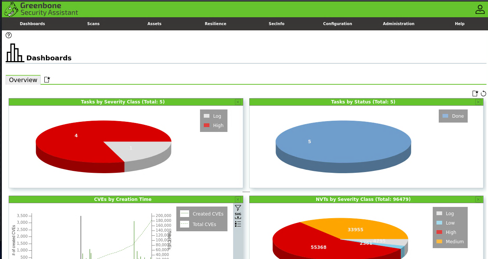
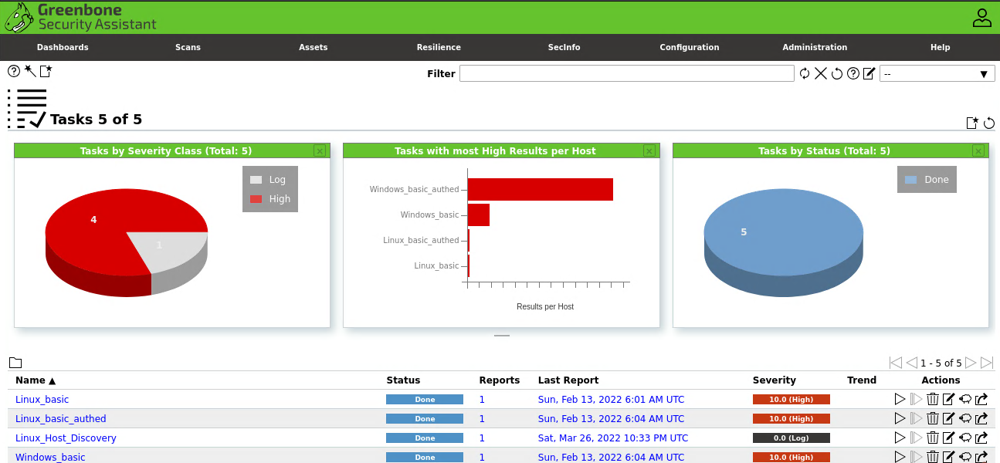
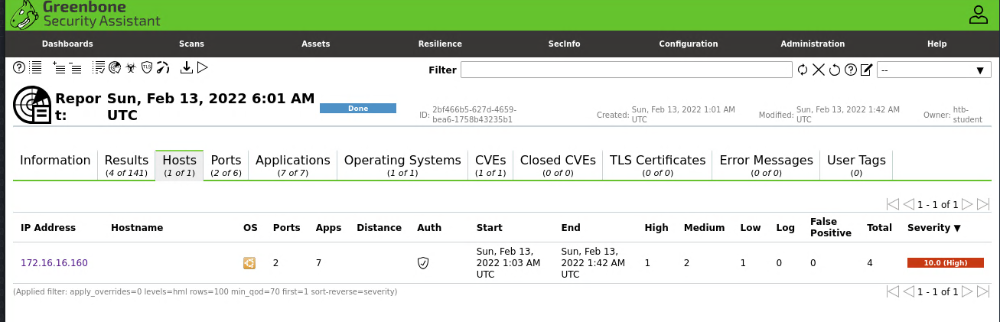
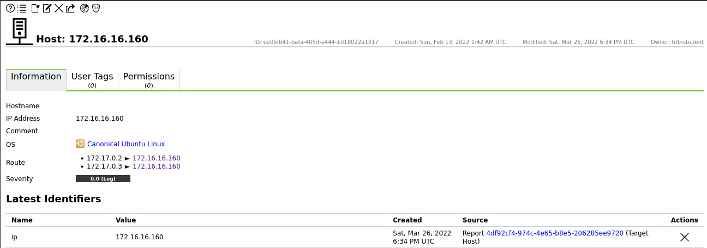

- 先從掃描清單打開 Linux 相關 report，再切到 `Hosts` 或主機資訊頁面。
- 在 `172.16.16.160` 的 host details 裡，`OS` 欄位顯示的是 `Canonical Ubuntu Linux`。
- 題目只要一個單字，所以填 `ubuntu`。

```text
ubuntu
```

### What type of FTP vulnerability is on the Linux host? (Case Sensitive, four words)

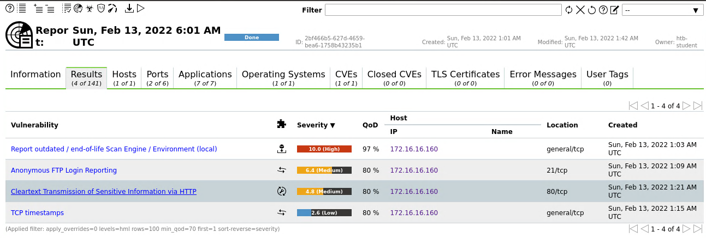

- 回到 `Results` 分頁後，可以直接看跟 FTP 有關的 finding。
- 這裡在 `21/tcp` 上的項目名稱就是 `Anonymous FTP Login Reporting`。
- 題目要求區分大小寫，照畫面原文填入即可。

```text
Anonymous FTP Login Reporting
```

### What is the IP of the Linux host targeted for the scan?


- 這題一樣直接看 `Hosts` 頁或 host information。
- 報表中只有一台 Linux host，而且 IP 明確列為 `172.16.16.160`。

```text
172.16.16.160
```

### What vulnerability is associated with the HTTP server? (Case-sensitive)


- 同一張 `Results` 清單裡，除了 FTP 之外也能看到 `80/tcp` 對應的 HTTP finding。
- 這一列的名稱是 `Cleartext Transmission of Sensitive Information via HTTP`，就是題目要的答案。

```text
Cleartext Transmission of Sensitive Information via HTTP
```
