# Getting Started

## Service Scanning
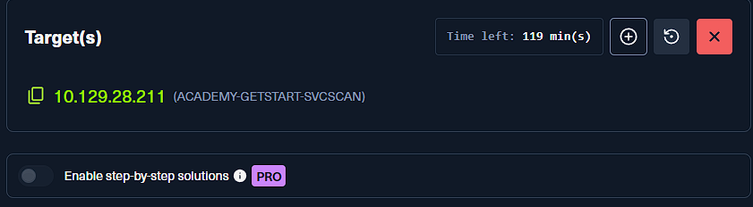

### Perform an Nmap scan of the target. What does Nmap display as the version of the service running on port 8080?
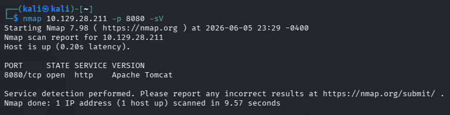

- 先對目標做基礎的 `nmap` 掃描，確認目前有哪些服務對外開放。
- 從掃描結果可以直接看到 `8080/tcp` 對應的服務為 `Apache Tomcat`。

```bash
Apache Tomcat
```

### Perform an Nmap scan of the target and identify the non-default port that the telnet service is running on
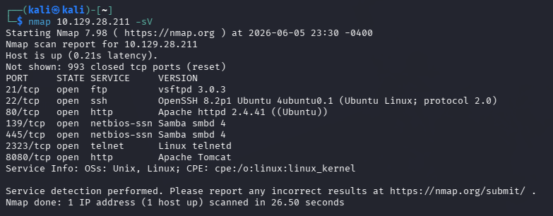

- `telnet` 預設通常使用 `23/tcp`，但這題是刻意放在其他 port。
- 從 `nmap` 結果可確認它實際運行在 `2323/tcp`。

```bash
2323
```

### List the SMB shares available on the target host. Connect to the available share as the bob user. Once connected, access the folder called 'flag' and submit the contents of the flag.txt file.
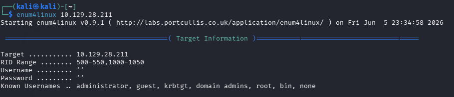

- 這裡先使用 `enum4linux` 枚舉 SMB 的基本資訊，包含可用的 share、帳號與權限設定。

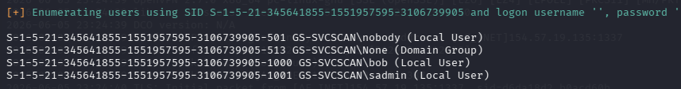

- 從枚舉結果中可以整理出目前有哪些使用者與分享資料夾可供進一步測試。
- 接著依照題目提示，使用 `bob` 的身分連入對應的 share。

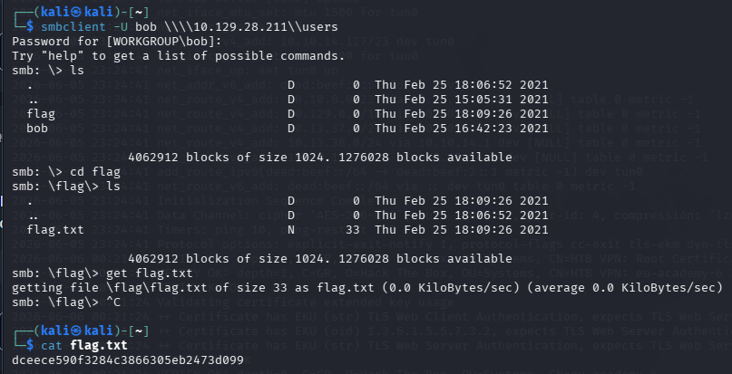

- 成功連線後進入 `flag` 目錄，讀取 `flag.txt` 即可取得答案。

```bash
dceece590f3284c3866305eb2473d099
```

## Web Enumeration
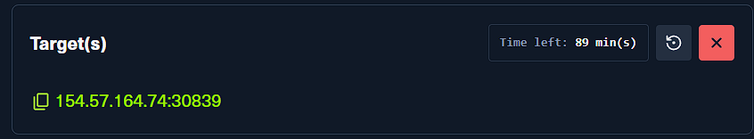

### Try running some of the web enumeration techniques you learned in this section on the server above, and use the info you get to get the flag.
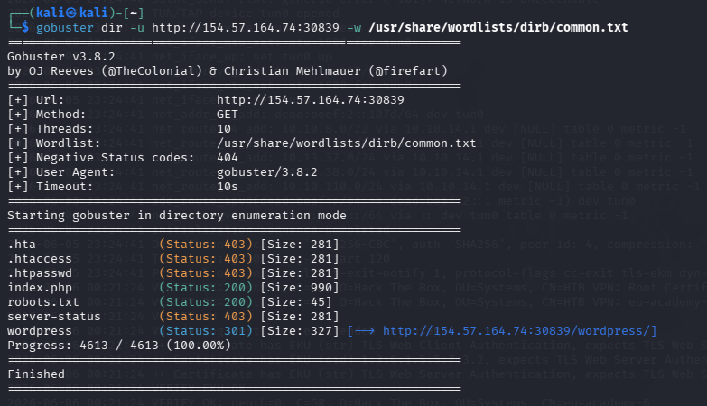

- 先使用 `gobuster` 對網站做目錄枚舉，找出手動瀏覽時不容易直接看到的路徑。
- 這一步的重點不是立刻找到 flag，而是先把站台暴露出來的入口整理清楚。

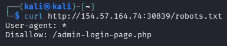

- 在枚舉結果中可以看到 `robots.txt`。
- `robots.txt` 主要是提供搜尋引擎爬蟲抓取規則，常見會用 `Disallow` 指出不希望被收錄的路徑，也可能用 `Allow` 明確放行特定位置。
- 因為它經常直接透露站台結構或隱藏路徑，所以很適合作為資訊蒐集的切入點，但它本身不是存取控制機制。

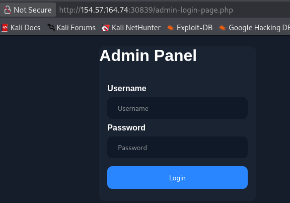

- 依照 `robots.txt` 提示進一步瀏覽後，可以看到這是一個登入用的 portal 頁面。

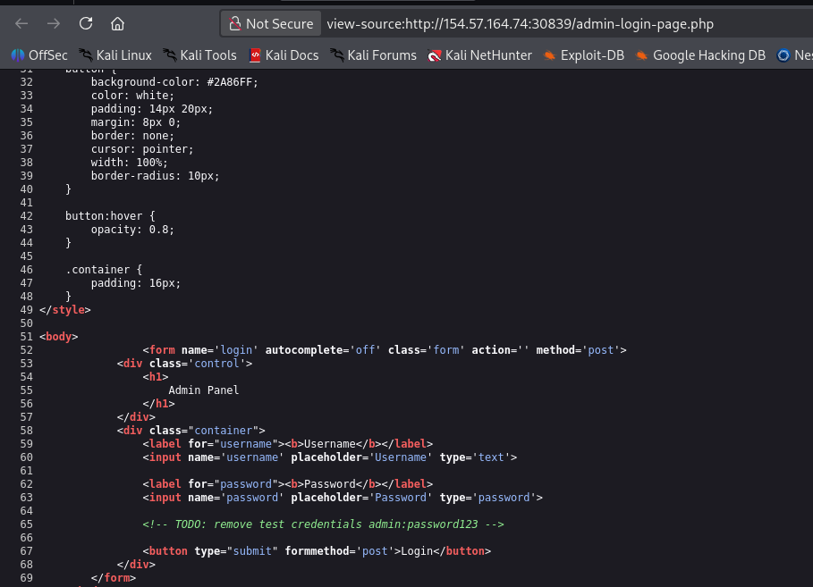

- 接著檢查該頁面的 HTML source，可以用 `curl` 或瀏覽器檢視原始碼。
- 這裡的重點是確認頁面是否把不該公開的資訊直接寫在前端。
- 實際查看後，可以發現登入用的帳號與密碼直接出現在原始碼中。

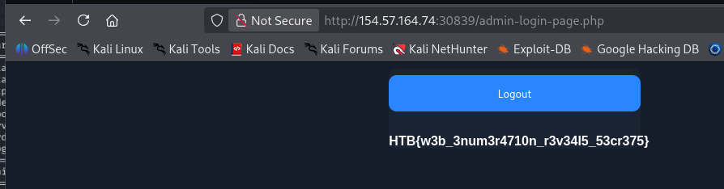

- 利用這組外洩的憑證登入 portal 後，就能直接取得題目要求的 flag。

```bash
HTB{w3b_3num3r4710n_r3v34l5_53cr375}
```

## Public Exploits

### Try to identify the services running on the server above, and then try to search to find public exploits to exploit them. Once you do, try to get the content of the '/flag.txt' file. (note: the web server may take a few seconds to start)
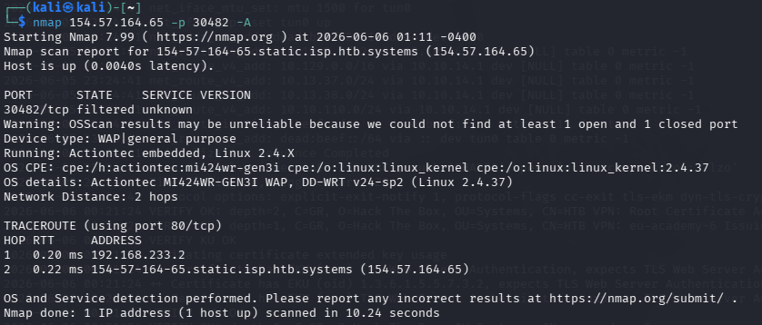

- 這一題一開始先用 `nmap` 嘗試辨識目標服務，但光靠掃描結果還不足以直接找到可用漏洞。

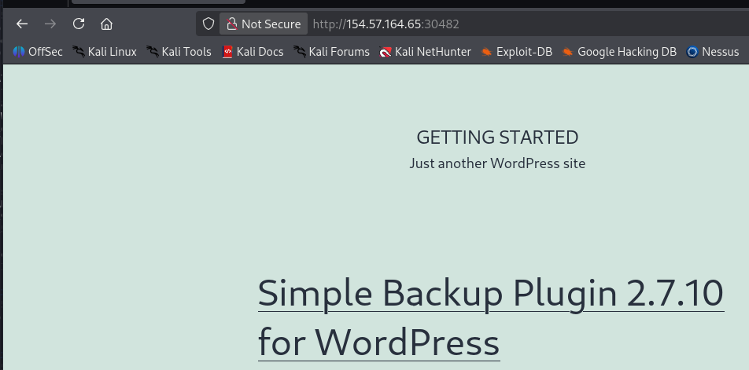

- 因此回到網頁本身觀察頁面內容，確認網站是否暴露了後端使用的服務、外掛或元件名稱。
- 找到明確名稱後，就可以把它當成關鍵字去搜尋公開 exploit。

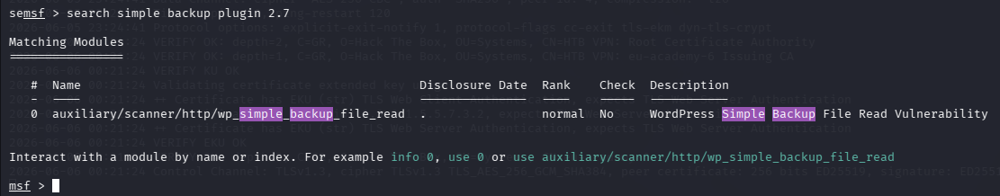

- 這裡使用 `msfconsole` 搜尋並選用對應的模組。

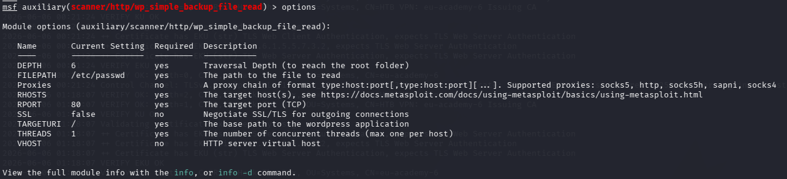

- 模組載入後先查看必要參數，至少要補上目標 IP、連接的 port，以及要讀取的檔案路徑。

```bash
set rhost <ip>
set rport <port>
set FILEPATH /flag.txt
```

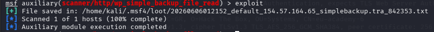

- 執行 exploit 後，模組會把目標上的 `/flag.txt` 拉回本地，並顯示儲存位置。

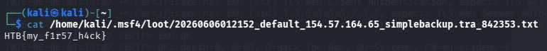

- 最後直接讀取模組下載回來的檔案內容，就可以取得 flag。

```bash
HTB{my_f1r57_h4ck}
```

## Privilege Escalation
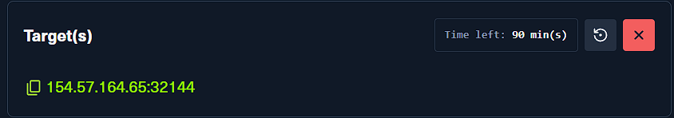

### SSH into the server above with the provided credentials, and use the '-p xxxxxx' to specify the port shown above. Once you login, try to find a way to move to 'user2', to get the flag in '/home/user2/flag.txt'.

- 題目已經提供 `user1 / password1`，所以第一步是先透過 SSH 登入目標主機。

```bash
# 將 <SSH_PORT> 換成題目畫面提供的連接埠
ssh user1@154.57.164.65 -p <SSH_PORT>
```

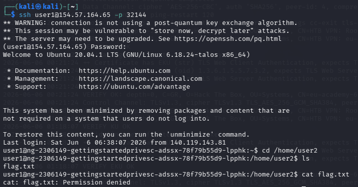

- 登入後可以確認目前是 `user1` 身分，但還無法直接讀取 `/home/user2/flag.txt`。

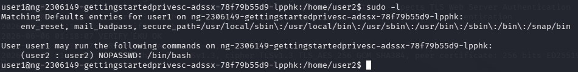

- 這時先執行 `sudo -l` 檢查 `user1` 有哪些可執行的 sudo 權限。
- 從結果可以看到 `user1` 可以不輸入密碼，以 `user2` 的身分執行 `/bin/bash`。

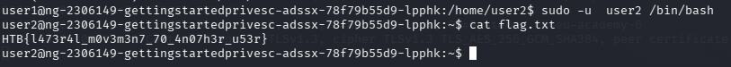

- 因此直接用下面的指令切換成 `user2`：

```bash
sudo -u user2 /bin/bash
```

- 成功切換後即可讀取 `/home/user2/flag.txt`。

```bash
HTB{l473r4l_m0v3m3n7_70_4n07h3r_u53r}
```

### Once you gain access to 'user2', try to find a way to escalate your privileges to root, to get the flag in '/root/flag.txt'.
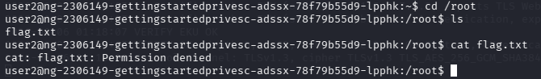

- 取得 `user2` 權限後，先從可存取的敏感目錄開始檢查，特別是 `/root` 相關內容。
- 這裡可以發現雖然還不能直接讀取 root flag，但能看到一些對提權很有幫助的檔案。

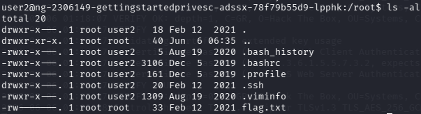

- 進一步查看後會發現 `/root/.ssh` 目錄存在，而且裡面有 root 使用的 SSH 私鑰。
- 這通常代表可以直接改走 SSH 金鑰登入這條路。

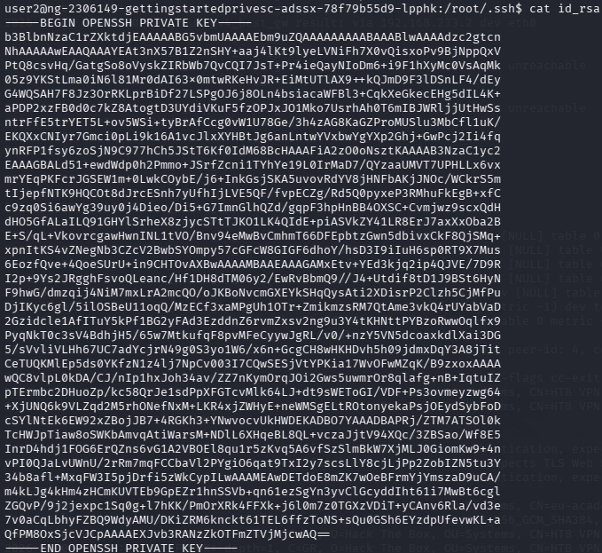

- 接著把私鑰內容複製到攻擊機本地，另存成 `id_rsa`。

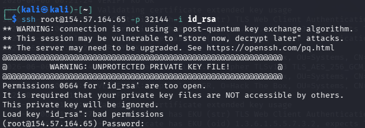

- 一開始直接使用私鑰登入會失敗，原因是私鑰檔案權限過於寬鬆。

```bash
chmod 600 id_rsa
ssh root@154.57.164.65 -p 32144 -i id_rsa
```

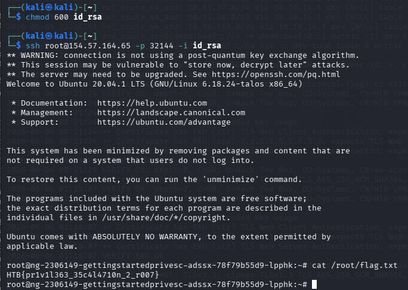

- 將私鑰權限調整為只有目前使用者可讀後，再重新登入即可成功切換成 `root`。
- 登入後讀取 `/root/flag.txt`，完成這一題的提權流程。

```bash
HTB{pr1v1l363_35c4l4710n_2_r007}
```
